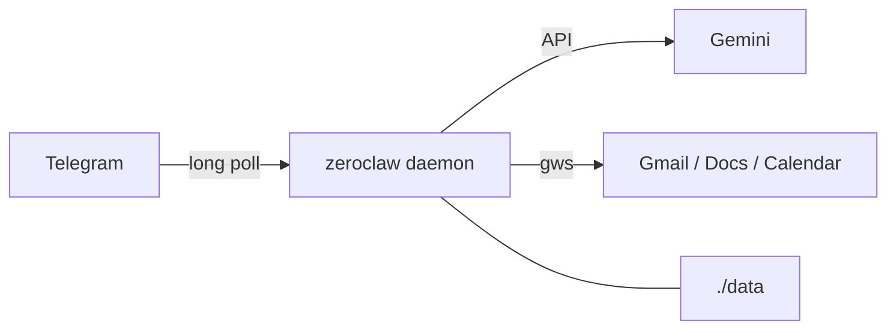

# docker_open_claw → ZeroClaw (lean)

A minimal Docker wrapper around **[ZeroClaw](https://github.com/zeroclaw-labs/zeroclaw)** — a single Rust binary agent runtime. This repo wires **Gemini + Telegram**, with optional thin **Google Workspace** (`gws` binary on distroless — not a full Debian image).

Upstream: [zeroclaw-labs/zeroclaw](https://github.com/zeroclaw-labs/zeroclaw) · [zeroclawlabs.ai](https://www.zeroclawlabs.ai/)

---

## Why ZeroClaw here

| | OpenClaw (old) | ZeroClaw (now) |
|---|---|---|
| Runtime | Node + plugins | Rust `zeroclaw daemon` |
| Idle RAM | Heavy | Official compose: ~32M reserve / **512M cap** |
| Chat | WhatsApp Web (QR) | **Telegram bot** (polls out) |
| Host ports | Gateway UI | **None** (Telegram needs egress only) |
| Config | JSON + clawhub | One `config.toml` + `.env` |
| Image | Custom Node | Upstream **distroless** + optional `gws` binary |

Google Workspace (Gmail, Docs, Calendar, …): [docs/google-workspace.md](docs/google-workspace.md). Flights still later — see [TODO.md](TODO.md).



---

## Prerequisites

- Docker + Docker Compose (on the machine that runs the container — often the Ubuntu server)
- [Gemini API key](https://aistudio.google.com/apikey)
- Telegram bot token from [@BotFather](https://t.me/BotFather) — [docs/telegram.md](docs/telegram.md)
- Optional WhatsApp (friend / group): [docs/whatsapp.md](docs/whatsapp.md)

**Google Workspace** (optional, auth on a browser PC — [docs/google-workspace.md](docs/google-workspace.md)):

- [Google Cloud SDK](https://cloud.google.com/sdk) (`gcloud`) — Windows: `choco install gcloudsdk`
- [`gws`](https://github.com/googleworkspace/cli) CLI

---

## Quick start

```bash
make init
# Edit .env:
#   GEMINI_API_KEY=...
#   TELEGRAM_BOT_TOKEN=...
#   TELEGRAM_ALLOWED_USERS=123456789   # numeric Telegram user id

make sync-config
make build
make up
make logs
```

Message your bot on Telegram. That is the whole loop.

Google Workspace (optional): [docs/google-workspace.md](docs/google-workspace.md) — OAuth export into `secrets/google/`, then redeploy.

```bash
make help          # all targets
make status        # health inside container
make down          # stop
```

### Deploy to an Ubuntu server (from Windows)

You do not need Docker on this PC.

**1. On the server (once)** — create the deploy folder and fix ownership:

```bash
# Docker + Compose
sudo apt update
sudo apt install -y docker.io docker-compose-v2
sudo usermod -aG docker "$USER"   # log out/in after this

# Project dir (match DEPLOY_PATH in .env — e.g. /zeroclaw)
sudo mkdir -p /zeroclaw
sudo chown "$USER:$USER" /zeroclaw

# Put your UID/GID in .env as ZEROCLAW_UID / ZEROCLAW_GID (run: id -u ; id -g)
```

No `chown 65534` needed when `ZEROCLAW_UID` matches your login user.

**2. On this PC** — set `DEPLOY_*` and `ZEROCLAW_UID`/`ZEROCLAW_GID` in `.env`, then:

```bash
make remote-check
make remote-deploy    # scp files + docker compose up on the server
make remote-logs
```

Full guide: [docs/deploy.md](docs/deploy.md).

---

## How setup works

1. **`make init`** — copies `.env.example`, creates `./data`, installs config template.
2. **`make sync-config`** — writes `config/config.toml` (model + Telegram allowlist from `.env`).
3. **`make up`** — runs ZeroClaw with `./data` for runtime state and bind-mounts `config/config.toml` read-only. API key and bot token come from schema-mirror env vars.
4. Daemon long-polls Telegram; **no host ports are published**.

```
config/config.toml     # yours — synced / edited by deploy user
data/                  # container runtime (UID 65534 on the server)
```

---

## Environment variables

| Variable | Required | Description |
|---|---|---|
| `GEMINI_API_KEY` | Yes | Google AI Studio key |
| `GEMINI_MODEL` | No | Default `gemini-3.5-flash` |
| `TELEGRAM_BOT_TOKEN` | Yes | From BotFather |
| `TELEGRAM_ALLOWED_USERS` | Yes | Comma-separated numeric user IDs |
| `ZEROCLAW_BASE` | No | Upstream image baked into the thin build (default `:latest`) |
| `ZEROCLAW_IMAGE` | No | Local tag after build (default `zeroclaw-gws:local`) |
| `GWS_VERSION` | No | `gws` release tag (default `v0.22.5`) |
| `DEPLOY_HOST` | Remote | Server hostname/IP for `make remote-*` |
| `DEPLOY_USER` | Remote | SSH user (default `ubuntu`) |
| `DEPLOY_PATH` | Remote | Remote project dir (default `/opt/zeroclaw`) |
| `DEPLOY_SSH_PORT` | Remote | SSH port (default `22`) |
| `DEPLOY_SSH_KEY` | Remote | Path to private key (optional) |

---

## Efficiency defaults

- Thin build: upstream **distroless** + single `gws` binary (no full Debian)
- **No published ports**
- `mem_limit: 512m`, `cpus: 2.0`
- Dashboard may exist inside the image; we never expose it

---

## Project layout

```
docker_open_claw/
├── docker-compose.yml
├── Dockerfile                 # distroless + gws binary
├── Makefile
├── .env.example
├── config/config.toml.example
├── secrets/google/            # OAuth export (gitignored)
├── scripts/sync-config.js
├── scripts/remote.ps1
├── scripts/remote.sh
├── docs/telegram.md
├── docs/whatsapp.md
├── docs/google-workspace.md
├── docs/deploy.md
└── data/
```

---

## Roadmap

See [TODO.md](TODO.md). Workspace: [docs/google-workspace.md](docs/google-workspace.md).

---

## License

Apache License 2.0 — see [LICENSE](LICENSE). ZeroClaw itself is MIT OR Apache-2.0 ([upstream](https://github.com/zeroclaw-labs/zeroclaw)).
