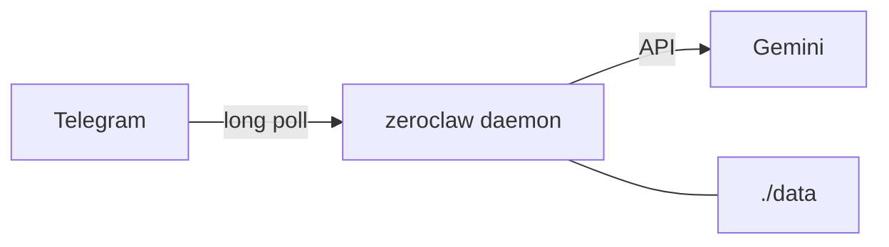

# docker_open_claw → ZeroClaw (lean)

A minimal Docker wrapper around **[ZeroClaw](https://github.com/zeroclaw-labs/zeroclaw)** — a single Rust binary agent runtime. This repo wires **Gemini + Telegram** only: no WhatsApp, no Node gateway, no published dashboard port.

Upstream: [zeroclaw-labs/zeroclaw](https://github.com/zeroclaw-labs/zeroclaw) · [zeroclawlabs.ai](https://www.zeroclawlabs.ai/)

---

## Why ZeroClaw here

| | OpenClaw (old) | ZeroClaw (now) |
|---|---|---|
| Runtime | Node + plugins | Rust `zeroclaw daemon` |
| Idle RAM | Heavy | Official compose: ~32M reserve / **512M cap** |
| Chat | WhatsApp Web (QR) | **Telegram bot** (polls out) |
| Host ports | Gateway UI | **None** (Telegram needs egress only) |
| Config | JSON + clawhub | One `config.toml` + `.env` |

Google Calendar / Gmail / flights are **phase 2** (MCP/tools). Chop first, integrate later — see [TODO.md](TODO.md).



---

## Prerequisites

- Docker + Docker Compose
- [Gemini API key](https://aistudio.google.com/apikey)
- Telegram bot token from [@BotFather](https://t.me/BotFather) — [docs/telegram.md](docs/telegram.md)

---

## Quick start

```bash
make init
# Edit .env:
#   GEMINI_API_KEY=...
#   TELEGRAM_BOT_TOKEN=...
#   TELEGRAM_ALLOWED_USERS=123456789   # numeric Telegram user id

make sync-config
make up
make logs
```

Message your bot on Telegram. That is the whole loop.

```bash
make help          # all targets
make status        # health inside container
make down          # stop
```

### Deploy to an Ubuntu server (from Windows)

You do not need Docker on this PC. Set `DEPLOY_*` in `.env`, then:

```bash
make remote-check
make remote-deploy    # scp files + docker compose up on the server
make remote-logs
```

Full guide: [docs/deploy.md](docs/deploy.md).

---

## How setup works

1. **`make init`** — copies `.env.example`, creates `./data`, installs config template.
2. **`make sync-config`** — writes `data/.zeroclaw/config.toml` (model + Telegram allowlist from `.env`).
3. **`make up`** — runs `ghcr.io/zeroclaw-labs/zeroclaw` with `./data` mounted at `/zeroclaw-data`. API key and bot token are passed as schema-mirror env vars (`ZEROCLAW_providers__…`, `ZEROCLAW_channels__…`).
4. Daemon long-polls Telegram; **no host ports are published**.

```
data/
├── .zeroclaw/config.toml    # generated / synced
└── data/                    # ZeroClaw workspace / memory
```

---

## Environment variables

| Variable | Required | Description |
|---|---|---|
| `GEMINI_API_KEY` | Yes | Google AI Studio key |
| `GEMINI_MODEL` | No | Default `gemini-2.5-flash` |
| `TELEGRAM_BOT_TOKEN` | Yes | From BotFather |
| `TELEGRAM_ALLOWED_USERS` | Yes | Comma-separated numeric user IDs |
| `ZEROCLAW_IMAGE` | No | Default `ghcr.io/zeroclaw-labs/zeroclaw:latest` |
| `DEPLOY_HOST` | Remote | Server hostname/IP for `make remote-*` |
| `DEPLOY_USER` | Remote | SSH user (default `ubuntu`) |
| `DEPLOY_PATH` | Remote | Remote project dir (default `/opt/zeroclaw`) |
| `DEPLOY_SSH_PORT` | Remote | SSH port (default `22`) |
| `DEPLOY_SSH_KEY` | Remote | Path to private key (optional) |

---

## Efficiency defaults

- Prebuilt GHCR image (no source build in this repo)
- **No published ports**
- `mem_limit: 512m`, `cpus: 2.0`
- Distroless image — use `make shell` (debian tag) only for debugging
- Dashboard may exist inside the image; we never expose it

---

## Project layout

```
docker_open_claw/
├── docker-compose.yml
├── Dockerfile                 # optional FROM official image
├── Makefile
├── .env.example
├── config/config.toml.example
├── scripts/sync-config.js     # host-side .env → config.toml
├── scripts/remote.ps1         # Windows → Ubuntu deploy
├── scripts/remote.sh          # Linux/WSL → Ubuntu deploy
├── docs/telegram.md
├── docs/deploy.md
└── data/                      # gitignored runtime state
```

---

## Roadmap

See [TODO.md](TODO.md). Phase 1 = this lean core. Phase 2 = Google Workspace / flights via ZeroClaw tools or MCP.

---

## License

Apache License 2.0 — see [LICENSE](LICENSE). ZeroClaw itself is MIT OR Apache-2.0 ([upstream](https://github.com/zeroclaw-labs/zeroclaw)).
