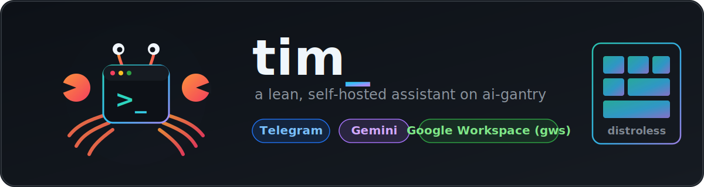
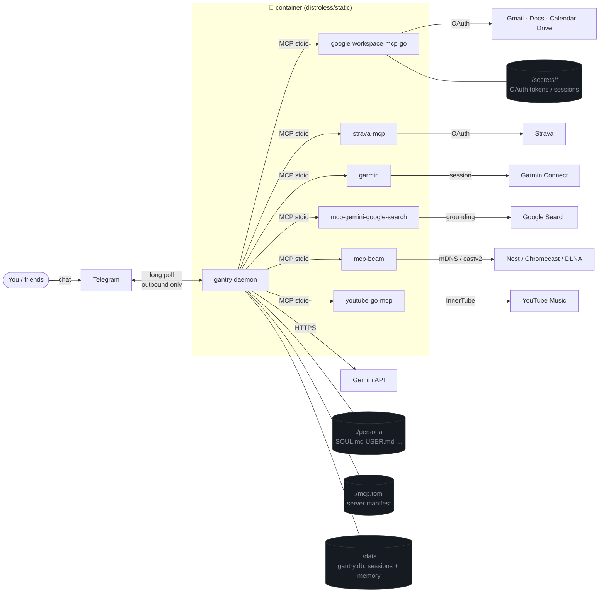
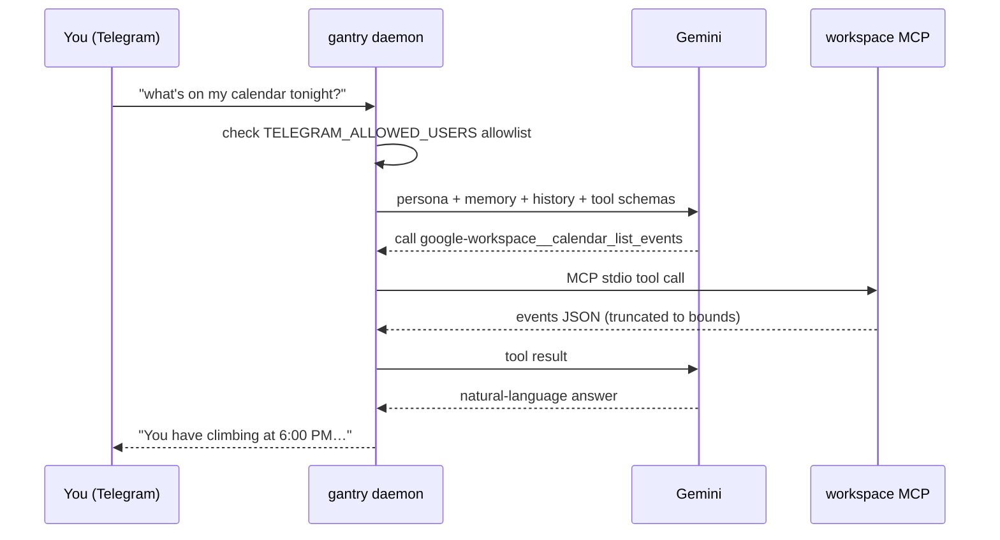
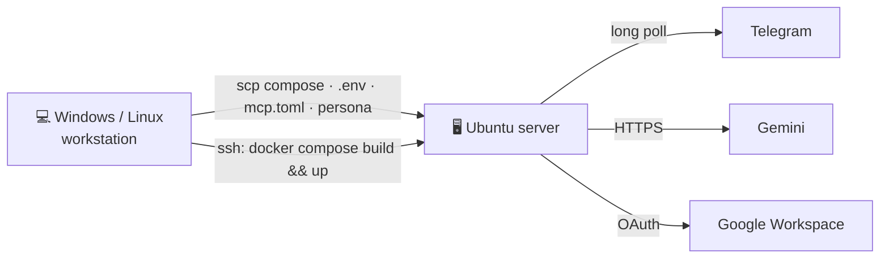
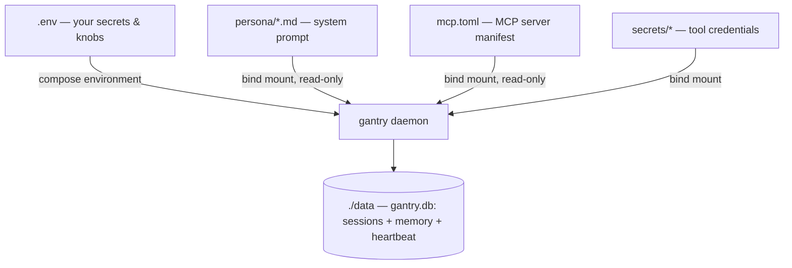

<p align="center">
  
</p>

# tim

**tim** is a lean, self-hosted personal assistant. Under the hood it's a thin wrapper — Make targets, a little PowerShell/Bash, and Docker Compose — around **[ai-gantry](https://github.com/shotah/ai-gantry)**, a single-binary Go agent runtime we own: one persona, one model, and whatever MCP tool binaries are baked next to it. You chat with Tim over **Telegram**; he thinks with **Gemini** and acts through static Go MCP servers (Google Workspace, Strava, Garmin, Cast, YouTube Music, web search).

Design goals: **tiny footprint, no inbound ports, one command to deploy.**

- 🏗️ One static Go daemon — no Node, no plugin zoo, no dashboard, no gateway
- 📴 Telegram long-polls outbound; **nothing is exposed to the internet, ever**
- 🧠 Gemini via a single `.env` key (any OpenAI-compatible endpoint works)
- 🧱 MCP-first: every capability is a static Go binary listed in [`mcp.toml`](mcp.toml)
- 🗂️ Inspectable SQLite memory (`data/gantry.db`) — typed rows, no embeddings
- 🚀 Deploy Windows → Ubuntu over SSH with `make remote-deploy`

---

## Table of contents

- [Architecture](#architecture)
- [Quick start (local)](#quick-start-local)
- [Deploy to a server](#deploy-to-an-ubuntu-server)
- [How setup works](#how-setup-works)
- [Documentation](#documentation)
- [Environment variables](#environment-variables)
- [Workout coaching (Strava)](#workout-coaching-strava)
- [Garmin recovery (sleep / weight)](#garmin-recovery-sleep--weight)
- [House Cast (speakers / displays)](#house-cast-speakers--displays)
- [YouTube Music](#youtube-music)
- [Make targets](#make-targets)
- [Design & efficiency notes](#design--efficiency-notes)
- [Project layout](#project-layout)
- [Migration from ZeroClaw](#migration-from-zeroclaw)
- [Roadmap](#roadmap)
- [License](#license)

---

## Architecture

The daemon reaches **out** to Telegram and Gemini; nothing dials in. Every tool is an MCP stdio child process — static Go binaries baked into the image and granted by being listed in `mcp.toml`.



**Request lifecycle** — what happens when you message the bot:



---

## Quick start (local)

Requires Docker + Docker Compose and a [Gemini API key](https://aistudio.google.com/apikey).

```bash
make init          # copy .env.example → .env, make ./data, seed persona/*.md
# Edit .env:
#   GEMINI_API_KEY=...
#   TELEGRAM_BOT_TOKEN=...            # from @BotFather
#   TELEGRAM_ALLOWED_USERS=123456789 # your numeric Telegram id

make build         # image = distroless/static + gantry + MCP tool binaries
make up            # start the daemon (no ports)
make logs          # watch it connect, then message your bot
```

That is the whole loop — no config sync step, no pairing. Bot setup details live in **[docs/telegram.md](docs/telegram.md)**.

```bash
make help          # every target, grouped
make status        # health check inside the container (exit code)
make down          # stop
```

---

## Deploy to an Ubuntu server

You do **not** need Docker on your workstation — only the server runs it. Files ship over `scp`, commands run over `ssh`.



```bash
# once, set DEPLOY_* and GANTRY_UID/GID in .env, then:
make remote-check     # verify SSH + Docker on the server
make remote-deploy    # sync files, build image, docker compose up -d
make remote-logs      # follow server logs
# message your bot — the allowlist is TELEGRAM_ALLOWED_USERS, no pairing step
```

Full walkthrough (server prep, UID/GID, OpenSSH on Windows): **[docs/deploy.md](docs/deploy.md)**.

---

## How setup works



1. **`make init`** — seeds `.env`, `./data`, and `persona/*.md` from templates.
2. **`make build` / `make up`** — builds the image (distroless/static + `gantry` release + MCP tool binaries) and runs the daemon.
3. Config is **env + mounts only**: `.env` holds secrets and knobs; `mcp.toml` lists MCP servers (listed = granted); `persona/` is the system prompt. There is no config file to render and no `config set`.
4. The daemon **long-polls** Telegram. Boot is fail-fast: a missing required var is a clear error and exit 1.

```text
mcp.toml            # committed — which MCP servers Tim gets
persona/*.md        # personal (gitignored); *.example.md templates committed
data/               # gantry.db — sessions, memory, heartbeat (gitignored)
secrets/*           # OAuth tokens / sessions for tools (gitignored)
```

---

## Documentation

Everything lives in [`./docs`](docs). Start with Telegram, add the rest as needed.

| Guide | What it covers | When you need it |
| --- | --- | --- |
| 📨 **[docs/telegram.md](docs/telegram.md)** | BotFather token, numeric user id, `TELEGRAM_ALLOWED_USERS` allowlist, `/new` session reset, `/status`, history bounds, SQLite memory | **Always** — this is the only chat channel |
| 🧠 **[docs/models.md](docs/models.md)** | One OpenAI-compatible chat provider (`LLM_*`); Gemini defaults; swapping chat to xAI/Grok/Ollama | Changing brain / cost tuning |
| 🎭 **[docs/persona.md](docs/persona.md)** | `persona/SOUL.md` / `USER.md` system prompt — coach mode, identity lock, vs SQLite memory | Shaping Tim's behavior |
| 🚀 **[docs/deploy.md](docs/deploy.md)** | Ubuntu server prep, UID/GID ownership, OpenSSH on Windows, the `make remote-*` workflow | Running on a real server |
| 🗂️ **[docs/google-workspace.md](docs/google-workspace.md)** | Go MCP (`google-workspace-mcp-go`), `make google-auth`, Docs/Gmail/Calendar tools | Gmail / Docs / Calendar / Drive |
| 🏃 **[docs/strava.md](docs/strava.md)** | Strava API app, `strava-mcp` OAuth, token mount, MCP wiring | Workout summaries & training nudges |
| ⌚ **[docs/garmin.md](docs/garmin.md)** | go-garmin MCP, `make garmin-auth`, sleep / weight / readiness | Physiological recovery + scale weight |
| 📺 **[docs/cast.md](docs/cast.md)** | mcp-beam (Go) release, host networking, `beam_youtube_video` / pause / volume | House Chromecast / Nest / DLNA |
| 🎵 **[docs/ytmusic.md](docs/ytmusic.md)** | youtube-go-mcp (Go), browser headers, search / library / liked | YouTube Music → `videoId` → Cast |
| 🔎 **[docs/web-search.md](docs/web-search.md)** | Google Search via Gemini grounding MCP (same API key) | Web answers |

Legacy proposals from the ZeroClaw era ([docs/whatsapp.md](docs/whatsapp.md), [docs/sms.md](docs/sms.md)) are kept for reference; extra channels are an explicit ai-gantry non-goal — one persona, one channel, one container.

Supporting files: [`SECURITY.md`](SECURITY.md) (hardening defaults & reporting).

---

## Environment variables

Set in `.env` (copy from [`.env.example`](.env.example)). Secrets are never committed. Compose maps the familiar `GEMINI_*` keys onto gantry's `LLM_*`; set `LLM_*` directly to use another OpenAI-compatible provider.

| Variable | Required | Description |
| --- | --- | --- |
| `TZ` | — | IANA timezone (default `America/Los_Angeles`; also used for cron) |
| `GEMINI_API_KEY` | ✅ | [Google AI Studio](https://aistudio.google.com/apikey) key (chat + search MCP) |
| `GEMINI_MODEL` | — | Default `gemini-3.5-flash` (see [docs/models.md](docs/models.md)) |
| `LLM_BASE_URL` / `LLM_API_KEY` / `LLM_MODEL` | — | Override all three to swap chat to xAI/Ollama/etc. |
| `TELEGRAM_BOT_TOKEN` | ✅ | From [@BotFather](https://t.me/BotFather) |
| `TELEGRAM_ALLOWED_USERS` | ✅ | Comma-separated numeric user IDs — the entire auth model; empty fails boot |
| `STREAM_REPLIES` | — | `true` = Telegram edit-in-place streaming (default `false`) |
| `MEMORY_*`, `HISTORY_*`, `TOOL_*`, `CRON_*` | — | gantry runtime knobs — see [ai-gantry §5.1](https://github.com/shotah/ai-gantry#51-environment-variables) |
| `STRAVA_CLIENT_ID` / `STRAVA_CLIENT_SECRET` | — | Strava API app (see [Workout coaching](#workout-coaching-strava)) |
| `GOOGLE_OAUTH_CLIENT_ID` / `GOOGLE_OAUTH_CLIENT_SECRET` / `USER_GOOGLE_EMAIL` | — | Google Workspace MCP OAuth (see [docs/google-workspace.md](docs/google-workspace.md)) |
| `GANTRY_VERSION` | — | shotah/ai-gantry release baked into the image (default pinned in `Dockerfile`) |
| `GANTRY_IMAGE` | — | Local tag after build (default `gantry-tim:local`) |
| `STRAVA_MCP_VERSION` / `GARMIN_MCP_VERSION` / `GEMINI_SEARCH_MCP_REF` / `GOOGLE_WORKSPACE_MCP_REF` | — | Tool build pins (defaults in `Dockerfile`) |
| `MCP_BEAM_VERSION` / `YOUTUBE_GO_MCP_VERSION` | — | shotah tool releases (`latest` default; pin `vX.Y.Z` to freeze) |
| `NETWORK_MODE` | Cast | `host` for Cast mDNS on Linux (default `bridge`) |
| `GANTRY_UID` / `GANTRY_GID` | server | Match the server login user (`id -u` / `id -g`) |
| `DEPLOY_HOST` / `DEPLOY_USER` / `DEPLOY_PATH` / `DEPLOY_SSH_PORT` / `DEPLOY_SSH_KEY` | remote | SSH deploy target (see [docs/deploy.md](docs/deploy.md)) |

---

## Workout coaching (Strava)

Tim can read your training history to summarize the week and nudge you ("get to the gym" / "rest today"). It uses the [`strava-mcp`](https://github.com/Stealinglight/StravaMCP) server — a single static binary baked into the image and listed in `mcp.toml`. Optional.

**Garmin users:** connect the watch to Strava once (Garmin Connect → *Connected Apps* → Strava); activities auto-sync and Tim reads them here — no fragile unofficial Garmin login. Garmin's own API is enterprise-only and currently closed to new sign-ups, so Strava is the robust path.

```bash
# 1. Create an app at https://www.strava.com/settings/api (callback domain: localhost)
#    and put the keys in .env:
#      STRAVA_CLIENT_ID=...
#      STRAVA_CLIENT_SECRET=...
# 2. Authorize once — writes secrets/strava/tokens.json:
make strava-auth
# 3. Deploy:
make up      # or: make remote-deploy
```

> **Rest-day caveat (Strava alone):** HRV / Body Battery / sleep are **not** on Strava. For those, wire Garmin — [docs/garmin.md](docs/garmin.md).

Full guide: **[docs/strava.md](docs/strava.md)**.

---

## Garmin recovery (sleep / weight)

Tim can read Garmin Connect for sleep, Index scale weight, Body Battery / HRV, and training readiness via [shotah/go-garmin](https://github.com/shotah/go-garmin) (`garmin mcp`) — a static Go binary baked into the image. Optional. No API app; one interactive login writes `secrets/garmin/session.json`.

```bash
make garmin-auth          # interactive login → session.json (+ garmin-sync if DEPLOY_HOST set)
make garmin-sync          # push session.json to server without re-login
make up                   # or: make remote-deploy
```

Ask Tim: "How did I sleep last night?" / "What's my weight trend?"

Full guide: **[docs/garmin.md](docs/garmin.md)**.

---

## House Cast (speakers / displays)

Tim can discover and control Chromecast / Nest / DLNA devices on your LAN via
[shotah/mcp-beam](https://github.com/shotah/mcp-beam) — a **static Go** release
binary baked into the image (same pattern as Strava/Garmin). No API keys.
Optional. Includes `beam_youtube_video` for Nest playback from a YouTube
`videoId` (pair with YouTube Music below).

**On the Linux home server**, enable host networking so mDNS works:

```bash
# in .env:
NETWORK_MODE=host
make up   # or: make remote-deploy
```

Ask Tim: "What Cast devices are online?" / "Play this liked track on the kitchen Nest."

Full guide: **[docs/cast.md](docs/cast.md)**.

---

## YouTube Music

Tim can search YouTube Music and read your library (playlists, liked songs, history)
via [youtube-go-mcp](https://github.com/shotah/youtube-go-mcp) — a **static Go**
binary baked into the image. Auth is browser-session headers (Premium rides along),
not a Data API key. Optional. Playback: hand `videoId` to Cast
`beam_youtube_video` (not a watch URL on `beam_media`).

```bash
make ytmusic-auth     # paste DevTools headers → secrets/ytmusic/headers.json
make up               # or: make remote-deploy
```

Ask Tim: "Search YouTube Music for … and play it on the kitchen Nest."

Full guide: **[docs/ytmusic.md](docs/ytmusic.md)**.

---

## Web search (Google via Gemini)

Tim searches the web through
[zchee/mcp-gemini-google-search](https://github.com/zchee/mcp-gemini-google-search)
— Gemini Grounding with Google Search, same `GEMINI_API_KEY` as chat, exposed as
the `google-search__google_search` tool. No scraping, no extra keys.

```bash
make up   # or: make remote-deploy
```

Ask Tim: "Search the web for …"

Full guide: **[docs/web-search.md](docs/web-search.md)**.

---

## Make targets

```bash
make help            # full grouped list
```

| Local | Remote (Windows/Linux → server) |
| --- | --- |
| `init`, `env`, `dirs`, `persona` | `remote-check` — SSH + Docker probe |
| `build` — distroless/static + gantry + tools | `remote-deploy` — sync + build + up |
| `up` / `down` / `restart` | `remote-sync` — scp compose/.env/mcp.toml/persona (not secrets) |
| `logs` / `ps` / `status` | `remote-up` / `remote-down` / `remote-restart` |
| `shell` — alpine with ./data (sqlite) | `remote-logs` / `remote-ps` / `remote-status` |
| `strava-auth` / `garmin-auth` / `google-auth` / `ytmusic-auth` | `remote-ssh [CMD='…']` — run on server |

---

## Design & efficiency notes

- **Thin image, no OS.** Multi-stage build fetches the pinned `gantry` release plus static Go MCP binaries and copies them onto `distroless/static` — no shell, no libc, no busybox shim. Healthchecks use exec form because there is nothing else to run.
- **Zero inbound ports.** Telegram polls outbound; the healthcheck is `gantry status` (an exit code, not an endpoint). Cast optionally uses host networking for LAN mDNS (see [docs/cast.md](docs/cast.md)).
- **Listed = granted.** `mcp.toml` is the entire tool ACL. No bundles, no risk profiles — the container composition is the sandbox, `TELEGRAM_ALLOWED_USERS` is the auth.
- **Bounded context.** History caps, tool-result truncation, and rolling summaries are gantry runtime knobs (`HISTORY_*`, `TOOL_*`) — token counts are labeled estimates.
- **Inspectable memory.** `data/gantry.db` is plain SQLite (typed memory rows + FTS5, no embeddings). `make shell` gives you an alpine box with it mounted; deliberate `memory_store`, correctable `memory_forget`.
- **Runs as your user.** `GANTRY_UID/GID` match the server login, so bind mounts write cleanly.
- **Bounded resources.** `mem_limit: 1g`, `cpus: 4.0`, `mem_reservation: 128m` — a single Go binary needs far less than the old stack.

---

## Project layout

```text
tim/
├── docker-compose.yml         # the gantry service (no ports; 1G / 4 CPU; NETWORK_MODE)
├── Dockerfile                 # distroless/static + gantry + workspace/strava/garmin/search/beam/ytmusic
├── Makefile                   # local + remote targets
├── .env.example               # all knobs, documented
├── mcp.toml                   # MCP server manifest — listed = granted
├── persona/                   # Tim's system prompt (*.example.md committed; *.md personal)
├── secrets/
│   ├── google-mcp/            # Workspace MCP OAuth tokens (gitignored)
│   ├── strava/                # OAuth token for strava-mcp (gitignored)
│   ├── garmin/                # Connect session for go-garmin (gitignored)
│   └── ytmusic/               # browser headers for youtube-go-mcp (gitignored)
├── scripts/
│   ├── deploy-manifest.txt    # single source of files to sync
│   ├── remote.ps1             # Windows → Ubuntu deploy
│   └── remote.sh              # Linux/WSL → Ubuntu deploy
├── docs/                      # per-tool guides (see Documentation above)
└── data/                      # gantry.db — sessions + memory + heartbeat (gitignored)
```

---

## Migration from ZeroClaw

This repo ran on [ZeroClaw](https://github.com/zeroclaw-labs/zeroclaw) until v0.0.1 of ai-gantry shipped. What changed:

1. **Runtime**: `zeroclaw` binary → pinned `gantry` release. Rust platform (multi-agent, gateway, dashboard, pairing, risk profiles) → single-persona Go kernel.
2. **Config**: `config/config.toml` + `sync-config` + schema-mirror env vars → `.env` + `mcp.toml` + `persona/` mounts. Nothing is rendered or synced.
3. **Persona**: `config/agents/main/workspace/*.md` → `persona/*.md` (same files, flat mount).
4. **Memory**: ZeroClaw's hybrid embedding memory does **not** migrate (by design — start clean). Persona files carry identity; gantry's structured SQLite memory rebuilds the rest. The old `config/` + `data/` trees can be deleted once you're happy.
5. **Dropped**: the `gws` CLI (needs glibc; the Go Workspace MCP replaced it long ago), the busybox `/bin/sh` shim (gantry never shells out), the `:42617` gateway/dashboard port, and `make sync-config` / `remote-bind`.

Roll back anytime: the last ZeroClaw-era commit still has the full old stack.

---

## Roadmap

Still open: Google OAuth export polish, a flight-search tool, cron-driven proactive nudges (gantry Milestone 6 is in — needs persona prompts), and a `docker compose config` CI check.

---

## License

Apache License 2.0 — see [LICENSE](LICENSE). [ai-gantry](https://github.com/shotah/ai-gantry) is MIT. The banner in `docs/assets/` is original art for this repo.
