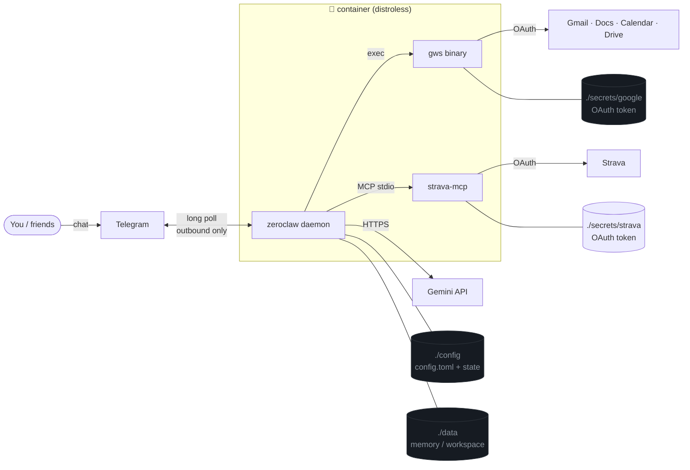
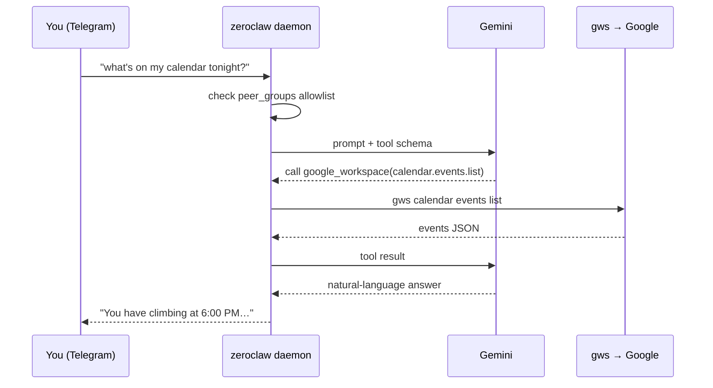
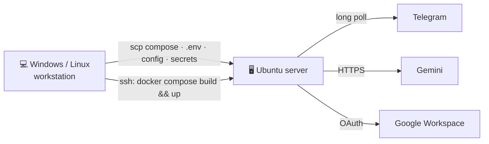
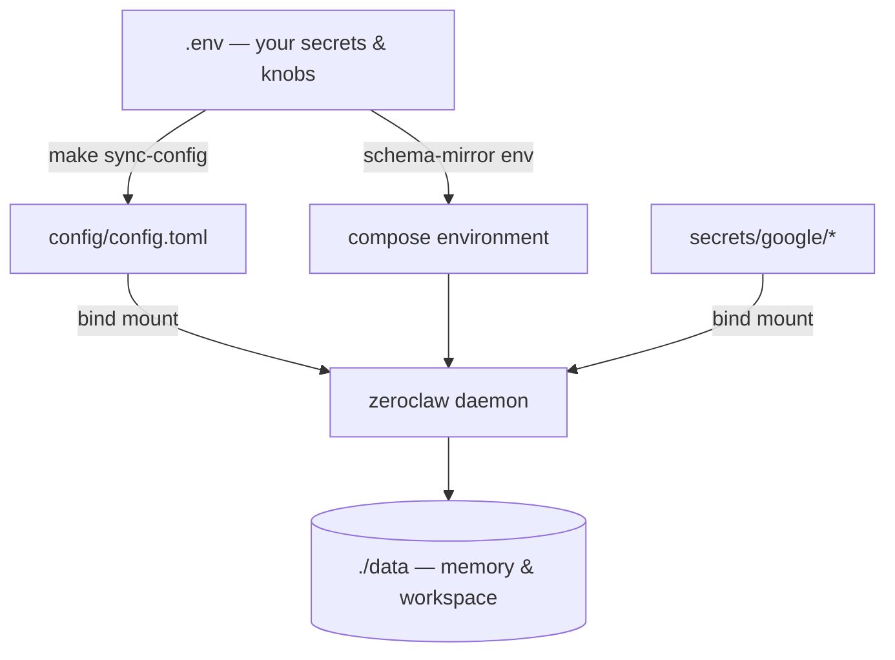
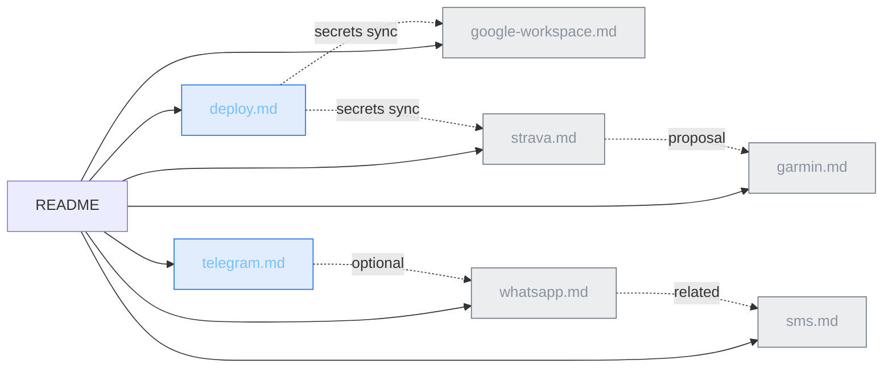

<p align="center">
  
</p>

# tim

**tim** is a lean, self-hosted personal assistant. Under the hood it's a thin wrapper — Make targets, a little PowerShell/Bash, and Docker Compose — around **[ZeroClaw](https://github.com/zeroclaw-labs/zeroclaw)**, a single-binary Rust agent runtime. You chat with Tim over **Telegram**; he thinks with **Gemini** and can act on your **Google Workspace** (Gmail, Docs, Calendar, Drive, …) through the [`gws`](https://github.com/googleworkspace/cli) CLI.

Design goals: **tiny footprint, no inbound ports, one command to deploy.**

- 🦀 One Rust daemon — no Node, no plugin zoo
- 📴 Telegram long-polls outbound; **nothing is exposed to the internet**
- 🧠 Gemini via a single `.env` key
- 🗂️ Optional Google Workspace on a **distroless** image (just the `gws` binary, ~19 MB added)
- 🚀 Deploy Windows → Ubuntu over SSH with `make remote-deploy`

---

## Table of contents

- [Architecture](#architecture)
- [Quick start (local)](#quick-start-local)
- [Deploy to a server](#deploy-to-an-ubuntu-server)
- [How setup works](#how-setup-works)
- [Documentation](#documentation)
- [Environment variables](#environment-variables)
- [Workout coaching (Strava)](#workout-coaching-strava)
- [Make targets](#make-targets)
- [Design & efficiency notes](#design--efficiency-notes)
- [Project layout](#project-layout)
- [Roadmap](#roadmap)
- [License](#license)

---

## Architecture

The daemon reaches **out** to Telegram and Gemini; nothing dials in. Google Workspace calls go through the `gws` binary baked into the image, authorized by an OAuth token you mount at `secrets/google/`.



**Request lifecycle** — what happens when you message the bot:



---

## Quick start (local)

Requires Docker + Docker Compose and a [Gemini API key](https://aistudio.google.com/apikey).

```bash
make init          # copy .env.example → .env, make ./data, install config template
# Edit .env:
#   GEMINI_API_KEY=...
#   TELEGRAM_BOT_TOKEN=...            # from @BotFather
#   TELEGRAM_ALLOWED_USERS=123456789 # your numeric Telegram id

make sync-config   # write config/config.toml from .env
make build         # thin image = distroless + gws
make up            # start the daemon (no published ports)
make logs          # watch it connect, then message your bot
```

That is the whole loop. Bot setup details live in **[docs/telegram.md](docs/telegram.md)**.

```bash
make help          # every target, grouped
make status        # health check inside the container
make down          # stop
```

---

## Deploy to an Ubuntu server

You do **not** need Docker on your workstation — only the server runs it. Files ship over `scp`, commands run over `ssh`.



```bash
# once, set DEPLOY_* and ZEROCLAW_UID/GID in .env, then:
make remote-check     # verify SSH + Docker on the server
make remote-deploy    # sync files, build image, docker compose up -d
make remote-logs      # follow server logs
make remote-bind      # approve your Telegram id if pairing is requested
```

Full walkthrough (server prep, UID/GID, OpenSSH on Windows): **[docs/deploy.md](docs/deploy.md)**.

---

## How setup works



1. **`make init`** — seeds `.env`, `./data`, and `config/config.toml` from templates.
2. **`make sync-config`** — [`scripts/sync-config.js`](scripts/sync-config.js) renders `config/config.toml`: Gemini model + the Telegram allowlist as schema-v3 `peer_groups`.
3. **`make build` / `make up`** — builds the thin image (upstream distroless + `gws`) and runs the daemon. `GEMINI_API_KEY` and `TELEGRAM_BOT_TOKEN` are injected as env, never written to disk.
4. The daemon **long-polls** Telegram; **no host ports are published**.

```
config/config.toml     # yours — synced/edited by the deploy user (gitignored)
data/                  # container runtime: memory + workspace (gitignored)
secrets/google/        # OAuth token for gws (gitignored)
```

---

## Documentation

Everything lives in [`./docs`](docs). Start with Telegram, add the rest as needed.

| Guide | What it covers | When you need it |
|---|---|---|
| 📨 **[docs/telegram.md](docs/telegram.md)** | BotFather token, numeric user id, schema-v3 `peer_groups` allowlist, `make remote-bind` pairing | **Always** — this is the default channel |
| 🚀 **[docs/deploy.md](docs/deploy.md)** | Ubuntu server prep, UID/GID ownership, OpenSSH on Windows, the `make remote-*` workflow | Running on a real server |
| 🗂️ **[docs/google-workspace.md](docs/google-workspace.md)** | Free Cloud project, OAuth scopes, `gws auth login/export`, UTF-8 credential export, smoke tests, troubleshooting | Gmail / Docs / Calendar / Drive access |
| 🏃 **[docs/strava.md](docs/strava.md)** | Strava API app, `strava-mcp` OAuth, token mount, MCP wiring, Garmin auto-sync, coaching caveats | Workout summaries & training nudges |
| ⌚ **[docs/garmin.md](docs/garmin.md)** | **Proposal** — Garmin MCP vs Strava gaps (sleep, weight, climb grades), pre-built servers, effort | Decide whether to add Garmin Connect |
| 💬 **[docs/whatsapp.md](docs/whatsapp.md)** | Web vs Cloud API (upstream selectors), `mode=personal`, peers/groups, when to skip WhatsApp | Reaching friends who don't use Telegram |
| 📱 **[docs/sms.md](docs/sms.md)** | **Proposal** — Twilio / Telnyx vs Google Voice / RCS; why GWS ≠ SMS; webhook + 10DLC caveats | Plain SMS texting |

Supporting files: [`SECURITY.md`](SECURITY.md) (hardening defaults & reporting).



---

## Environment variables

Set in `.env` (copy from [`.env.example`](.env.example)). Secrets are never committed.

| Variable | Required | Description |
|---|---|---|
| `GEMINI_API_KEY` | ✅ | [Google AI Studio](https://aistudio.google.com/apikey) key |
| `GEMINI_MODEL` | — | Default `gemini-3.5-flash` |
| `TELEGRAM_BOT_TOKEN` | ✅ | From [@BotFather](https://t.me/BotFather) |
| `TELEGRAM_ALLOWED_USERS` | ✅ | Comma-separated numeric user IDs (become `peer_groups` members) |
| `STRAVA_CLIENT_ID` | — | Strava API app client ID (see [Workout coaching](#workout-coaching-strava)) |
| `STRAVA_CLIENT_SECRET` | — | Strava API app client secret |
| `ZEROCLAW_BASE` | — | Upstream image baked into the build (default `:latest`) |
| `ZEROCLAW_IMAGE` | — | Local tag after build (default `zeroclaw-gws:local`) |
| `GWS_VERSION` | — | Override the `gws` release tag (default pinned in the `Dockerfile`) |
| `STRAVA_MCP_VERSION` | — | Override the `strava-mcp` release tag (default pinned in the `Dockerfile`) |
| `ZEROCLAW_UID` / `ZEROCLAW_GID` | server | Match the server login user (`id -u` / `id -g`) |
| `DEPLOY_HOST` | remote | Server hostname / IP |
| `DEPLOY_USER` | remote | SSH user (default `ubuntu`) |
| `DEPLOY_PATH` | remote | Remote project dir (e.g. `/zeroclaw`) |
| `DEPLOY_SSH_PORT` | remote | SSH port (default `22`) |
| `DEPLOY_SSH_KEY` | remote | Path to private key (optional) |

---

## Workout coaching (Strava)

Tim can read your training history to summarize the week and nudge you ("get to the gym" / "rest today"). It uses the [`strava-mcp`](https://github.com/Stealinglight/StravaMCP) server — a single static binary baked into the image (like `gws`) and wired over MCP. Optional.

**Garmin users:** connect the watch to Strava once (Garmin Connect → *Connected Apps* → Strava); activities auto-sync and Tim reads them here — no fragile unofficial Garmin login. Garmin's own API is enterprise-only and currently closed to new sign-ups, so Strava is the robust path.

```bash
# 1. Create an app at https://www.strava.com/settings/api (callback domain: localhost)
#    and put the keys in .env:
#      STRAVA_CLIENT_ID=...
#      STRAVA_CLIENT_SECRET=...
# 2. Authorize once on a browser machine (or WSL) — writes secrets/strava/tokens.json:
STRAVA_TOKEN_PATH="$PWD/secrets/strava/tokens.json" strava-mcp auth
# 3. Deploy:
make sync-config && make build && make up      # or: make remote-deploy
```

> **Rest-day caveat:** HRV / Body Battery / sleep are **Garmin-only** and not exposed via Strava. "Rest today" is inferred from training frequency and load — good coaching, not physiological readiness.

Full guide: **[docs/strava.md](docs/strava.md)**.

---

## Make targets

```bash
make help            # full grouped list
```

| Local | Remote (Windows/Linux → server) |
|---|---|
| `init`, `env`, `dirs`, `config` | `remote-check` — SSH + Docker probe |
| `sync-config` — `.env` → `config.toml` | `remote-deploy` — sync + build + up |
| `build` — thin distroless + `gws` | `remote-sync` — scp files & secrets |
| `up` / `down` / `restart` | `remote-up` / `remote-down` / `remote-restart` |
| `logs` / `ps` / `status` | `remote-logs` / `remote-ps` / `remote-status` |
| `shell` — debug (debian image) | `remote-bind` — approve a Telegram id |
| `pull` — upstream base | `remote-ssh [CMD='…']` — run on server |

---

## Design & efficiency notes

- **Thin image.** Multi-stage build fetches `gws` and the static `strava-mcp` (~7 MB) binaries, then copies just those onto upstream distroless — no full OS in the runtime.
- **No published ports.** Telegram polls outbound; the gateway binds `127.0.0.1` only.
- **Bounded resources.** `mem_limit: 512m`, `cpus: 2.0`, tiny reservation.
- **Runs as your user.** `ZEROCLAW_UID/GID` match the server login, so bind mounts and pairing state write cleanly (no `chown 65534` dance).
- **Deny-by-default access.** Telegram `peer_groups.*.external_peers` gates who the agent answers; the dashboard is never exposed.

---

## Project layout

```
tim/
├── docker-compose.yml         # the ZeroClaw service (no ports, 512M cap)
├── Dockerfile                 # distroless + gws + strava-mcp (multi-stage)
├── Makefile                   # local + remote targets
├── .env.example               # all knobs, documented
├── config/
│   └── config.toml.example    # schema-v3 template (Gemini, Telegram, Workspace, MCP)
├── secrets/
│   ├── google/                # OAuth export for gws (gitignored)
│   └── strava/                # OAuth token for strava-mcp (gitignored)
├── scripts/
│   ├── sync-config.js         # .env → config/config.toml
│   ├── deploy-manifest.txt    # single source of files to sync
│   ├── remote.ps1             # Windows → Ubuntu deploy
│   └── remote.sh              # Linux/WSL → Ubuntu deploy
├── docs/
│   ├── assets/banner.svg
│   ├── telegram.md
│   ├── deploy.md
│   ├── google-workspace.md
│   ├── strava.md
│   ├── garmin.md              # proposal: Garmin MCP (not implemented)
│   ├── sms.md                 # proposal: SMS / Twilio vs Google (not implemented)
│   └── whatsapp.md
└── data/                      # runtime memory/workspace (gitignored)
```

---

## Roadmap

Still open: Google OAuth export polish, WhatsApp Web for a friend/group, a flight-search tool, pinning `ZEROCLAW_BASE` to a specific `v0.x.y` tag, and a `docker compose config` CI check.

---

## License

Apache License 2.0 — see [LICENSE](LICENSE). ZeroClaw itself is MIT OR Apache-2.0 ([upstream](https://github.com/zeroclaw-labs/zeroclaw)). The banner in `docs/assets/` is original art for this repo.
