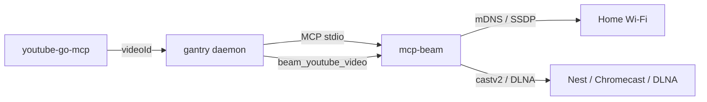

# Google Cast / DLNA (house speakers & displays)

Give Tim local control of Chromecast / Nest / Cast-enabled speakers and TVs
(plus DLNA/UPnP renderers) via [mcp-beam](https://github.com/shotah/mcp-beam)
— a **static Go** MCP server built on [go2tv](https://github.com/alexballas/go2tv).
No API keys, no cloud registration. gantry launches the binary over stdio
(same pattern as `strava-mcp` / `garmin` / `youtube-go-mcp`).

Build source: [shotah/mcp-beam](https://github.com/shotah/mcp-beam) (fork of
[alexballas/mcp-beam](https://github.com/alexballas/mcp-beam) with volume/mute +
`beam_youtube_video`). Module `go2tv.app/mcp-beam`.



**No secrets.** Nothing under `secrets/` — discovery and control are entirely
local.

> **Critical:** Docker bridge networking usually cannot see LAN mDNS/SSDP. On a
> Linux home server, enable host networking (step 2 below) or discovery will
> return empty.

> **Language policy:** this stack bakes **compiled Go** tool MCPs only — not
> Node/Bun/Python wrappers. The TS `daanrongen/cast-mcp` is intentionally not
> used.

---

## What Tim can do

`mcp-beam` exposes 10 tools (prefixed `cast__…` because the server name in
`mcp.toml` is `cast`):

| Ask | Tool |
|---|---|
| “What Cast / DLNA devices are on the network?” | `list_local_hardware` |
| “Play this URL / file on the kitchen speaker” | `beam_media` |
| “Play this YouTube / Music track on the Nest” | `beam_youtube_video` |
| “What’s playing?” | `get_beaming_status` |
| Pause / resume / stop | `pause_beaming`, `play_beaming`, `stop_beaming` |
| Seek | `seek_beaming` |
| Volume / mute | `set_beaming_volume` (0–100), `mute_beaming` |

Typical music flow: ytmusic `search_tracks` / library → note `videoId` →
`list_local_hardware` → `beam_youtube_video` with bare `video_id` + device id →
pause/volume/stop via `session_id`.

**Do not** pass `https://music.youtube.com/watch?v=…` to `beam_media` — that is
a web page, not a stream. Nest will connect and stay silent. Use
`beam_youtube_video`.

**Discovery defaults** (also in `TOOLS.md`): always pass a longer timeout and
keep sleepy devices — Nest Hub Max often loses a short race to Mini / TV:

```json
{
  "timeout_ms": 10000,
  "include_unreachable": true
}
```

Call discovery twice a few seconds apart if a known device is still missing
(go2tv’s mDNS cache fills in the background). Default tool timeout is 5s and
`include_unreachable` defaults to `false`.

For real tracks, source `videoId` from [docs/ytmusic.md](ytmusic.md)
(`youtube-go-mcp`) — don’t invent royalty-free MP3s.

---

## 1. Optional `.env` pin

No Cast credentials. The image downloads the
[shotah/mcp-beam](https://github.com/shotah/mcp-beam/releases) release binary
(default `latest` each build). Pin only to freeze:

```env
# MCP_BEAM_VERSION=v0.0.1
# MCP_BEAM_LOG_LEVEL=info
```

`ffmpeg` / `ffprobe` are **optional** — needed only when `beam_media` must
transcode. Direct Chromecast URL play and `beam_youtube_video` usually work
without them. Distroless has no ffmpeg; if you hit `FFMPEG_NOT_FOUND`, prefer a
direct-playable URL, `transcode: "never"`, or YouTube-by-id.

---

## 2. Host networking (required for discovery)

Set `NETWORK_MODE` in `.env` so the container shares the host network stack
(mDNS/SSDP + castv2 to LAN devices). Main `docker-compose.yml` interpolates it:

```env
NETWORK_MODE=host
```

Default is `bridge` (fine without Cast / on Docker Desktop). gantry opens no
ports either way — `host` only exists so mDNS/SSDP discovery can reach the LAN.

**Linux home server:** use `host`. **Docker Desktop (Windows/Mac):** leave
`bridge` — prefer deploying Cast on the Ubuntu box.

---

## 3. Deploy / restart

```bash
# In .env: NETWORK_MODE=host
make build           # bakes mcp-beam into the image
make up              # or make remote-deploy
```

Ensure the server’s `.env` has `NETWORK_MODE=host` before `remote-up`.

---

## Config wiring

`mcp.toml` already has (listed = granted):

```toml
[[server]]
name    = "cast"
command = "mcp-beam"
```

---

## Smoke tests

```bash
make build
docker compose run --rm --entrypoint mcp-beam gantry --version
docker compose run --rm --entrypoint mcp-beam gantry --self-test
```

With host networking enabled and devices on the LAN, ask Tim over Telegram:

- “Scan for Cast devices”
- “Play \<track\> from my liked songs on the kitchen Nest”
- “Pause what’s playing on the living room TV”
- “Set the kitchen speaker to 30%” / “Mute the TV”

---

## Troubleshooting

| Symptom | Likely fix |
|---|---|
| Tim doesn’t see Cast tools | Check the `[[server]]` entry in `mcp.toml`; rebuild so `mcp-beam` is in the image |
| Boot fails with `mcp: boot server "cast"` | `make build` / `make remote-deploy`; check `make logs` for the tool's stderr |
| `list_local_hardware` returns empty / missing Nest Max | Set `NETWORK_MODE=host` in `.env`; same subnet/VLAN; use `timeout_ms: 10000` + `include_unreachable: true` (see Discovery defaults); retry a few seconds later; if Chrome/Google Home also can’t see it, it’s network/mDNS |
| Nest connects but no music | Don’t use `beam_media` with a YouTube/Music watch URL — use `beam_youtube_video` with the bare `video_id` from ytmusic |
| `FFMPEG_NOT_FOUND` | Use a direct-playable URL / `transcode: "never"` / `beam_youtube_video`, or add ffmpeg later (not in distroless by default) |
| Play fails / wrong device | Re-run discovery; pass the stable device `id` from `list_local_hardware` |
| Works on server, not on Windows Docker | Expected — use the home Linux host for Cast |
| Image build fails in mcp-beam stage | Check a release exists on [shotah/mcp-beam releases](https://github.com/shotah/mcp-beam/releases); if pinned, verify `MCP_BEAM_VERSION` |
| Stale mcp-beam after a new release | Rebuild via `make build` / `make remote-deploy` (TOOLS_CACHEBUST re-resolves `latest`) |

---

## vs other MCPs

| | Cast (`mcp-beam`) | Strava / Garmin / Google |
|---|---|---|
| Language | Go (static) | Go (static) |
| Auth | None | OAuth / session |
| Network | Host mode for mDNS | Bridge fine (HTTPS out) |
| Secrets | None | `secrets/*` mounts |
| Scope | Local LAN only | Cloud APIs |

---

## House rooms (Chris)

Authoritative for Tim: `config/agents/main/workspace/TOOLS.md` (Cast section). Summary:

| Room | Devices | Default |
|---|---|---|
| Bathroom | Nest Mini | Nest Mini (shower / getting ready) |
| Kitchen | Nest Max; Samsung fridge smart hub | Nest Max (fridge only if asked) |
| Living room | Nest Max; Sony / Google TV; Sony surround (Cast) | Nest Max for audio; TV/surround for watch/TV |
| Bedroom | Nest Max (original); Cast mega speaker | Nest Max (go easy on night volume) |

After first successful `list_local_hardware`, you can store confirmed friendly names → rooms in `MEMORY.md` if useful — don’t invent names discovery never returned.

---

## Follow-ups

- [x] Volume/mute + `beam_youtube_video` on [shotah/mcp-beam](https://github.com/shotah/mcp-beam) (release bake; default `latest`)
- [x] Authenticated YouTube Music via [youtube-go-mcp](ytmusic.md)
- [x] Named-room map in `TOOLS.md` / `docs/cast.md`
