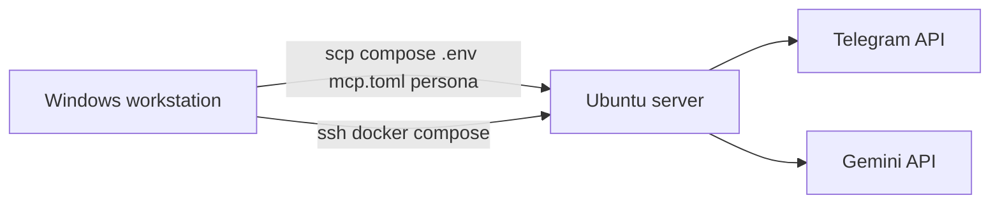

# Deploy to an Ubuntu server

Run tim (ai-gantry) on a remote Ubuntu box from this Windows (or Linux) workstation via **SSH + scp**. Docker only needs to run on the **server**.



---

## Server prerequisites

On the Ubuntu host (once):

```bash
# Docker Engine + Compose plugin
sudo apt update
sudo apt install -y docker.io docker-compose-v2
sudo usermod -aG docker "$USER"   # then log out/in

# Project dir — match DEPLOY_PATH in .env (examples: /gantry or /opt/gantry)
sudo mkdir -p /gantry
sudo chown "$USER:$USER" /gantry
```

Set `GANTRY_UID` / `GANTRY_GID` in `.env` to your server user (`id -u` / `id -g`, usually `1000`). The container runs as that user so `data/` and `secrets/` writes work without any `chown` dance.

Ensure outbound HTTPS works (Telegram + Gemini). Telegram polling needs **no inbound ports**, and gantry opens none — the healthcheck is `gantry status` (an exit code), so there is no dashboard or gateway port to protect.

---

## Workstation prerequisites (Windows)

1. **OpenSSH Client** — Settings → Apps → Optional features → OpenSSH Client
   Or: `Add-WindowsCapability -Online -Name OpenSSH.Client~~~~0.0.1.0`
2. SSH key access to the server (`ssh ubuntu@your-host` works without a password prompt, or with your key).
3. This repo + `make` (Git Bash / chocolatey `make` / etc.).

You do **not** need Docker Desktop on Windows if you only use `make remote-*`.

---

## Configure `.env`

```env
# … Gemini + Telegram secrets …

DEPLOY_HOST=myserver.example.com
DEPLOY_USER=user
DEPLOY_PATH=/gantry
DEPLOY_SSH_PORT=22
DEPLOY_SSH_KEY=C:/Users/you/.ssh/id_ed25519
```

Leave `DEPLOY_SSH_KEY` blank to use your default agent / `~/.ssh/id_*`.

---

## Deploy

```bash
make remote-check         # SSH + docker available?
make remote-deploy        # sync files + docker compose up -d
make remote-logs          # follow server logs
```

No config render step — `.env`, `mcp.toml`, and `persona/` are the config.

Or step by step:

| Command | What it does |
| --- | --- |
| `make remote-sync` | scp compose, Makefile, `.env`, `mcp.toml`, persona, scripts (not token/session secrets) |
| `make garmin-sync` / `strava-sync` / `ytmusic-sync` / `google-sync` | Push one secret group (also auto after `*-auth` when `DEPLOY_HOST` is set) |
| `make secrets-sync` | Push all secret groups |
| `make remote-up` | `docker compose build --pull && up -d` on server |
| `make remote-down` | stop stack on server |
| `make remote-restart` | restart |
| `make remote-ps` | compose ps |
| `make remote-status` | `gantry status` (exit-code heartbeat check) |
| `make remote-ssh` | interactive shell in `DEPLOY_PATH` |

---

## What gets copied

Synced (full list: `scripts/deploy-manifest.txt`):

- `docker-compose.yml`, `Makefile`, `.env`, `.env.example`, `Dockerfile`
- `mcp.toml` — the MCP server manifest
- `persona/*.md` — Tim's system prompt (templates + your personal files)
- `scripts/`, `docs/`, `README.md`

**Not** synced by `remote-deploy`:

- local `data/` runtime state (`gantry.db`) — server keeps its own
- token/session files under `secrets/*` (Garmin / Strava / YT Music / Google) —
  push deliberately with `make garmin-sync` etc. so a stale laptop file can't
  overwrite a good server session

To wipe server state intentionally (sessions + memory + heartbeat):

```bash
make remote-ssh CMD='rm -f data/gantry.db* && docker compose restart'
```

---

## Security notes

- `.env` (with API keys) is copied to the server over SSH — keep the box locked down (SSH keys only, no password auth).
- Prefer a dedicated deploy user with Docker group access, not root login.
- `DEPLOY_*` is only used by the workstation Makefile; the container does not need those vars.

---

## Escaping Windows

When you move the workstation to Ubuntu, the same `.env` works — `make remote-*` calls `scripts/remote.sh` instead of `remote.ps1`. No rewrite required.
