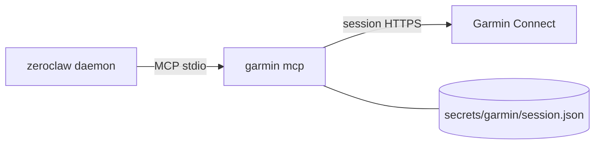

# Garmin Connect MCP (go-garmin)

**Status:** decided — use [llehouerou/go-garmin](https://github.com/llehouerou/go-garmin)
(`garmin mcp`). **Not wired yet**; checklist below mirrors Strava.

Upstream: [go-garmin](https://github.com/llehouerou/go-garmin) · compare with
[docs/strava.md](strava.md).



Auth is lighter than Strava: **no API app, no client id/secret.** Login once
interactively (email / password / MFA); the CLI writes
`session.json`. Runtime only needs that file + `HOME` so
`os.UserConfigDir()` resolves to the mount.

Session path (from go-garmin `session.go`):

```text
$XDG_CONFIG_HOME/garmin/session.json
# with HOME=/zeroclaw-data in compose →
/zeroclaw-data/.config/garmin/session.json
```

> README shows `garmin login -email=… -password=…`, but current upstream
> `login.go` is **interactive prompts only** (TTY). Plan `make garmin-auth`
> as `docker compose run --rm -it …`.

---

## Why bother (vs Strava)

| Need | Strava | go-garmin |
|---|---|---|
| Activity list | ✅ | ✅ |
| Sleep / Body Battery / HRV / readiness | ❌ | ✅ |
| Index scale weight | ❌ | ✅ |
| Climb grades / attempts (`typedsplits`) | ❌ | ⚠️ may need small PR |
| Official OAuth app | ✅ | ❌ unofficial session |

Keep Strava for now; drop later if Garmin alone is enough.

---

## `.env` / `.env.example` — what to add

**Runtime credentials: nothing.** Do **not** put Garmin email/password in
`.env` (avoids the Strava-style client-secret weight and keeps the password
out of compose).

Add only an optional **build pin** (same idea as `STRAVA_MCP_VERSION`):

```env
# --- Garmin Connect (optional) ----------------------------------------------
# Sleep, Body Battery, HRV, scale weight, activities via go-garmin MCP.
# Auth is one interactive login (make garmin-auth) → secrets/garmin/session.json
# Guide: docs/garmin.md
# Optional: pin go-garmin git ref for the Dockerfile build stage (default in Dockerfile).
# GARMIN_MCP_REF=cbf5895e08bf32ea5510aabfd392c892055de2ab
```

| Variable | Required? | Purpose |
|---|---|---|
| *(none for runtime)* | — | Session file on the volume is enough |
| `GARMIN_MCP_REF` | optional | Pin go-garmin commit/tag for reproducible image builds |

go-garmin has **no GitHub Releases** yet → Dockerfile builds from source with
`go build` / `go install` at `GARMIN_MCP_REF`, not `curl` of a tarball.

---

## Integration checklist

Work top-to-bottom. Copy the Strava pattern; differences called out.

### 1. Secrets layout

- [ ] `secrets/garmin/.gitkeep`
- [ ] `secrets/garmin/.gitignore` (ignore `*` except keep/gitignore — same as Strava)
- [ ] Root `.gitignore`: ignore `secrets/garmin/*` with `!.gitkeep` / `!.gitignore`
- [ ] `scripts/deploy-manifest.txt`: add `secrets/garmin/.gitkeep` and
      `secrets/garmin/session.json` (missing files are skipped)

### 2. Dockerfile

- [ ] `ARG GARMIN_MCP_REF=<pinned-commit>` (default the known-good SHA)
- [ ] New stage: Debian/trixie + Go toolchain, `CGO_ENABLED=0`,
      `go build -o /garmin ./cmd/garmin` from
      `github.com/llehouerou/go-garmin@${GARMIN_MCP_REF}`
      (or `git clone` + checkout + build — either works)
- [ ] `COPY --from=garmin /garmin /usr/local/bin/garmin`
- [ ] Smoke: `/garmin --version` or `/garmin --help` in the build stage
- [ ] Confirm binary is static / runs on distroless (same bar as `strava-mcp`)

No release URL to curl (unlike Strava) — **compile in-image**.

### 3. `docker-compose.yml`

- [ ] Forward build arg: `GARMIN_MCP_REF` under `build.args`
- [ ] **Do not** pass `GARMIN_EMAIL` / `GARMIN_PASSWORD` into `environment`
- [ ] Volume (session only):

  ```yaml
  - ./secrets/garmin:/zeroclaw-data/.config/garmin
  ```

- [ ] `HOME` is already `/zeroclaw-data` → session lands at
      `/zeroclaw-data/.config/garmin/session.json` automatically.
      No extra env var required for the token path.

### 4. Makefile

- [ ] `.PHONY` + help line for `garmin-auth`
- [ ] Target (interactive TTY — lighter than Strava’s published callback port):

  ```make
  garmin-auth: ## One-time Garmin login; writes secrets/garmin/session.json
  	$(COMPOSE) run --rm --build -it --entrypoint garmin $(SERVICE) login
  ```

- [ ] Help docs line: `docs/garmin.md`
- [ ] No `-p` port mapping (no OAuth browser dance)

### 5. `config/config.toml.example`

- [ ] `agents.main.mcp_bundles = ["strava", "garmin"]` (or garmin-only later)
- [ ] Server:

  ```toml
  [[mcp.servers]]
  name = "garmin"
  transport = "stdio"
  command = "garmin"
  args = ["mcp"]
  ```

- [ ] Bundle:

  ```toml
  [mcp_bundles.garmin]
  servers = ["garmin"]
  ```

- [ ] `risk_profiles.default.auto_approve`: add prefixed names
      `garmin__get_sleep`, `garmin__get_weight`, `garmin__get_body_battery`,
      `garmin__get_hrv`, `garmin__get_training_readiness`,
      `garmin__list_activities`, `garmin__get_activity`, … (exact list from
      `garmin mcp` / upstream README — verify at wire time)
- [ ] Keep `[mcp] deferred_loading = false` (Flash + MCP lesson from Strava)

### 6. Docs / README polish (when implementing)

- [ ] Flesh this file into a how-to (auth → deploy → troubleshooting)
- [ ] README docs table: mark garmin as optional/wired (not just proposal)
- [ ] Optional: mention typed-splits follow-up for climb grades

### 7. Smoke test after wire-up

- [ ] `make build` — image contains `/usr/local/bin/garmin`
- [ ] `make garmin-auth` — interactive login, `secrets/garmin/session.json` appears
- [ ] `docker compose run --rm --entrypoint garmin zeroclaw sleep` returns JSON
- [ ] `make up` — Tim can answer “how did I sleep?” / “what’s my weight trend?”
- [ ] Climb grades: if missing, file typed-splits PR against go-garmin

---

## Auth flow (vs Strava)

| | Strava | Garmin (go-garmin) |
|---|---|---|
| App registration | Strava API app + client id/secret in `.env` | None |
| Secrets in `.env` | `STRAVA_CLIENT_ID`, `STRAVA_CLIENT_SECRET` | **None** (optional `GARMIN_MCP_REF` only) |
| One-shot auth | Browser OAuth + localhost callback port `19876` | Interactive `garmin login` (TTY) |
| Persisted artifact | `secrets/strava/tokens.json` | `secrets/garmin/session.json` |
| Make target | `make strava-auth` (`-p 19876:19876`) | `make garmin-auth` (`-it`, no ports) |
| Runtime env | client id/secret + `STRAVA_TOKEN_PATH` | mount + `HOME` only |

---

## Risks (unchanged)

Unofficial Connect API, MFA/session expiry, young upstream (pin commit),
climbing typed-splits may need a small PR. Full background:
[language landscape](#why-bother-vs-strava) and earlier research in git history
if needed.

---

## Decision

- [x] Use go-garmin (not Python Taxuspt)
- [x] Auth = session file only; no Garmin password in `.env`
- [ ] Implement checklist items 1–7 when ready
