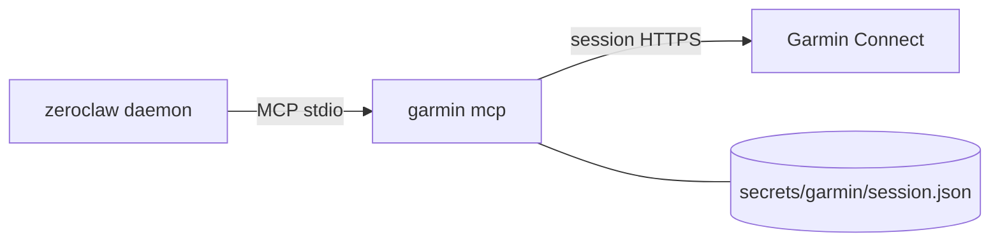

# Garmin Connect (sleep, weight, readiness)

Give Tim your Garmin-native recovery data — sleep, Index scale weigh-ins, Body
Battery / HRV, training readiness — via the
[go-garmin](https://github.com/shotah/go-garmin) CLI’s built-in MCP server
(`garmin mcp`). A static Go binary is baked into the image (like `gws` /
`strava-mcp`); ZeroClaw launches it over stdio.

**Keep Strava** for the activity feed if you want; Garmin fills the gaps Strava
never had. Climbing grades / falls / sends come from typed splits + split
summaries (already in go-garmin MCP).

Build source: [shotah/go-garmin](https://github.com/shotah/go-garmin) (DI auth
fork of [llehouerou/go-garmin](https://github.com/llehouerou/go-garmin)) · see
also [docs/strava.md](strava.md).



Auth is lighter than Strava: **no API app, no client id/secret.** Login once
interactively (email / password / MFA); the CLI writes `session.json`. Runtime
only needs that file + `HOME` so `os.UserConfigDir()` resolves to the mount.

Session path (go-garmin `session.go`):

```text
$XDG_CONFIG_HOME/garmin/session.json
# with HOME=/zeroclaw-data in compose →
/zeroclaw-data/.config/garmin/session.json
```

> Upstream README mentions `garmin login -email=… -password=…`, but current
> `login.go` is **interactive prompts only** (TTY). Use `make garmin-auth`.

---

## What Tim can do

Curated tools are auto-approved in `config/config.toml.example` (prefixed
`garmin__…`):

| Ask | Tool |
|---|---|
| "How did I sleep last night?" | `get_sleep` |
| "What's my weight trend?" | `get_weight` |
| "Am I recovered enough to train?" | `get_body_battery`, `get_hrv`, `get_training_readiness` |
| "What did I do this week?" | `list_activities`, `get_activity` |

---

## 1. Optional `.env` pin

**No Garmin email/password in `.env`.** The image downloads the
[shotah/go-garmin](https://github.com/shotah/go-garmin/releases) release
binary (default `v0.1.0`). Override only to bump:

```env
# GARMIN_MCP_VERSION=v0.1.0
```

---

## 2. Authorize once (`make garmin-auth`)

```bash
make garmin-auth
```

That builds the image if needed, then:

```bash
docker compose run --rm --build -it --entrypoint garmin zeroclaw login
```

1. Enter Garmin Connect **email**, **password**, and **MFA** if prompted.
2. On success: `Login successful.` and `secrets/garmin/session.json` on the host
   (mounted at `/zeroclaw-data/.config/garmin`).

No published ports (unlike Strava’s OAuth callback). Re-run if the session
expires — `make garmin-auth` deletes any existing `session.json` first so a
stale “already logged in” file doesn’t block refresh.

---

## 3. Deploy / restart

```bash
make sync-config     # if you refreshed from config.toml.example
make build           # bakes garmin into the image
make up              # or make remote-deploy
```

`make remote-deploy` copies `secrets/garmin/session.json` when present (listed
in `scripts/deploy-manifest.txt`).

---

## Config wiring

`config/config.toml.example` already has:

```toml
mcp_bundles = ["strava", "garmin"]

[[mcp.servers]]
name = "garmin"
transport = "stdio"
command = "garmin"
args = ["mcp"]

[mcp_bundles.garmin]
servers = ["garmin"]
```

Plus `garmin__get_sleep`, `garmin__get_weight`, … in
`risk_profiles.default.auto_approve`. Keep `[mcp] deferred_loading = false`
(same Flash lesson as Strava).

If you already have a live `config/config.toml`, merge those blocks in (or
re-copy from the example carefully) — `make sync-config` only patches model /
Telegram peers, not MCP.

Compose mounts:

```yaml
- ./secrets/garmin:/zeroclaw-data/.config/garmin
```

`HOME=/zeroclaw-data` is already set, so the CLI finds the session with no
extra env vars.

---

## Smoke tests

```bash
make build
docker compose run --rm --entrypoint garmin zeroclaw --help

# After garmin-auth:
docker compose run --rm --entrypoint garmin zeroclaw sleep
docker compose run --rm --entrypoint garmin zeroclaw weight daily
```

Then ask Tim over Telegram: “How did I sleep last night?” / “What’s my latest
scale weight?” / “How was my last climbing session — grades and falls?”

### Climbing API shape (what Tim should use)

| Need | Tool | Fields |
|---|---|---|
| Session falls / sends / max grade | `list_activities` or `get_activity_split_summaries` | `numFalls`, `numClimbSends`, `numClimbsCompleted`, `maxClimbGrade` / `maxGradeValue` |
| Per-route grades + completed vs attempted | `get_activity_typed_splits` | `type`=`CLIMB_ACTIVE`, `status`=`CLIMB_COMPLETED`\|`CLIMB_ATTEMPTED`, `gradeValue` (`VERMIN`/`YDS`/`FONT`) |

Watch “falls” ≈ `numFalls` on the `CLIMB_ACTIVE` split summary (not a separate
endpoint). Bouldering often shows attempts via `CLIMB_ATTEMPTED` status instead.

---

## Troubleshooting

| Symptom | Likely fix |
|---|---|
| Tim doesn’t see Garmin tools | Grant bundle: `mcp_bundles = ["strava", "garmin"]` + `[mcp_bundles.garmin]`; rebuild so `garmin` is in the image |
| `garmin: not found` | `make build` / `make remote-deploy` |
| `not logged in` | `make garmin-auth`; confirm `secrets/garmin/session.json` exists and was synced |
| Every call asks for approval | Add exact `garmin__<tool>` names to `auto_approve` |
| Auth / 401 after weeks | Session expired — re-run `make garmin-auth` (clears stale `session.json` first) |
| Rate limited (429) | Unofficial Connect API — ask for summaries, don’t poll |

### `OAuth2 exchange failed: 401` on `make garmin-auth`

**Your password is fine.** If you saw `Email:` / `Password:` / `MFA Code:` and then:

```text
Error: failed to exchange for OAuth2 token: OAuth2 exchange failed: 401 Unauthorized
```

that was the **pre-fix** go-garmin path (`…/oauth-service/oauth/exchange/user/2.0`).
Tim now builds [shotah/go-garmin](https://github.com/shotah/go-garmin) with
mobile SSO + **DI** tokens (`diauth…/di-oauth2-service/oauth/token`), same idea as
`garminconnect` ≥ 0.3.

**If login still fails after rebuilding the image:**

1. **Stop retrying** for a bit — failed SSO can trigger account+client **429**
   blocks that last hours.
2. Cloudflare may still block plain Go TLS (Python uses `curl_cffi`). Note the
   exact status (403/429/other) before another attempt.
3. Keep Strava for workouts until auth sticks once (`session.json` then refreshes).

---

## Auth flow (vs Strava)

| | Strava | Garmin (go-garmin) |
|---|---|---|
| App registration | Strava API app + client id/secret in `.env` | None |
| Secrets in `.env` | `STRAVA_CLIENT_ID`, `STRAVA_CLIENT_SECRET` | **None** (optional `GARMIN_MCP_VERSION`) |
| One-shot auth | Browser OAuth + port `19876` | Interactive `garmin login` (TTY) |
| Persisted artifact | `secrets/strava/tokens.json` | `secrets/garmin/session.json` |
| Make target | `make strava-auth` | `make garmin-auth` |
| Runtime env | client id/secret + `STRAVA_TOKEN_PATH` | mount + `HOME` only |

---

## Follow-ups

- [x] Climbing typed-splits / grades / falls (go-garmin MCP)
- [ ] Decide whether to drop Strava once Garmin activity coverage feels enough
- [ ] Expand `auto_approve` if you want workouts / biometric tools

---

## Risks

Unofficial Connect API (can break), MFA/session expiry, young upstream (we pin
`GARMIN_MCP_VERSION`). Accept those or stay Strava-only for activities.
