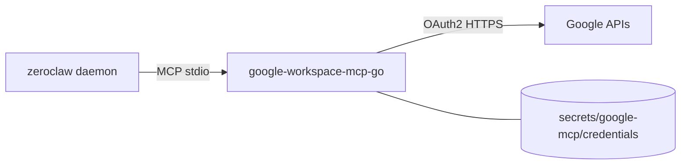

# Google Workspace (Gmail / Calendar / Docs / Drive)

Tim talks to Google through a **compiled Go MCP binary**:
[`magks/google-workspace-mcp-go`](https://github.com/magks/google-workspace-mcp-go)
(stdio, static build, baked into the image like Strava/Garmin).

The built-in ZeroClaw `google_workspace` tool (raw `gws`) is **disabled** —
it rejects camelCase methods such as `batchUpdate`, so Docs writes fail before
they reach Google. Prefer this MCP.



---

## What Tim can do (core tier)

Config loads `--tools gmail drive calendar docs sheets tasks contacts` with
`--tool-tier core` (~45 tools). Useful examples:

| Ask | Tool (approx.) |
|---|---|
| “What’s unread?” | `search_gmail_messages` / `get_gmail_message_content` |
| “What’s on my calendar Friday?” | `get_events` |
| “Update the Seattle itinerary doc” | `modify_doc_text` / `find_and_replace_doc` |
| “Create a sheet of …” | `create_spreadsheet` / `modify_sheet_values` |

Bump to `--tool-tier extended` or `complete` in `config.toml` if you need
rarer ops (then recreate the container).

---

## 1. OAuth client (once)

1. [Google Cloud Console](https://console.cloud.google.com/) → project
2. Enable APIs you need (Gmail, Calendar, Docs, Drive, Sheets, Tasks, People, …)
3. OAuth consent (External + your Gmail as test user while in Testing)
4. Credentials → OAuth client ID → **Desktop app**
5. Authorized redirect URI (add if prompted):
   `http://localhost:4100/oauth2callback`

Put into `.env`:

```env
GOOGLE_OAUTH_CLIENT_ID=….apps.googleusercontent.com
GOOGLE_OAUTH_CLIENT_SECRET=GOCSPX-…
USER_GOOGLE_EMAIL=you@gmail.com
```

> **Testing vs Production:** OAuth apps in **Testing** expire refresh tokens
> after ~7 days. Move the consent screen to **Production** (or re-run
> `make google-auth` weekly).

---

## 2. Authorize (`make google-auth`)

Same pattern as Strava/Garmin — **no local `gws`**. Docker runs a throwaway
Python container that:

1. Clears any stale `secrets/google-mcp/credentials/<email>.json`
2. Prints a Google consent URL
3. Listens on `localhost:4100` for the callback
4. Writes the MCP credential file Tim mounts at runtime

```bash
make google-auth
```

1. Open the printed URL, approve access.
2. Browser hits `http://localhost:4100/oauth2callback` → container captures the code.
3. On success: `secrets/google-mcp/credentials/<you@email>.json`

Then deploy:

```bash
make remote-deploy   # or: make build && make up
```

Send **`/new`** in Telegram so Tim drops any stale auth habit.

Access tokens refresh automatically from the stored `refresh_token`. If Google
revokes the refresh token (or Testing-mode expiry hits), re-run
`make google-auth`.

---

## 3. Config already wired

```toml
[google_workspace]
enabled = false

[[mcp.servers]]
name = "google-workspace"
transport = "stdio"
command = "google-workspace-mcp-go"
args = ["--tools", "gmail drive calendar docs sheets tasks contacts", "--tool-tier", "core"]

[mcp_bundles.google-workspace]
servers = ["google-workspace"]

[agents.main]
mcp_bundles = ["google-workspace", "strava", "garmin", "google-search"]
```

Compose mounts `./secrets/google-mcp` → `/zeroclaw-data/.config/google-mcp` and
sets `WORKSPACE_MCP_CREDENTIALS_DIR`, `GOOGLE_OAUTH_*`, `USER_GOOGLE_EMAIL`.

---

## Legacy: import from `gws` (optional)

If you already have a host `gws` export and prefer not to re-consent:

```bash
make google-mcp-import   # secrets/google/credentials.json → google-mcp format
```

Prefer **`make google-auth`** for new setups (no local gws dependency).

---

## Troubleshooting

- **Docs write fails with “only lowercase…” / `batchUpdate`** — that’s the
  **built-in** tool. Confirm `[google_workspace] enabled = false` and that Tim
  is using MCP tools (`modify_doc_text`, etc.). `/new` after deploy.
- **MCP auth / 401 / “expired”** — re-run `make google-auth`, then
  `make remote-deploy`. Check OAuth app isn’t stuck in Testing (7-day refresh).
- **Callback never completes** — port `4100` free on the host; Desktop client
  allows `http://localhost:4100/oauth2callback`.
- **No `refresh_token` in response** — revoke prior grant at
  [Google Account permissions](https://myaccount.google.com/permissions), then
  `make google-auth` again (`prompt=consent` is already set).
- **Tim ignores Workspace MCP** — `mcp_bundles` must include
  `google-workspace`; `[mcp] deferred_loading = false`.
- **Too many tools / context bloat** — keep `--tool-tier core`; drop unused
  services from `--tools`.
- **Permission denied on secrets/** — readable by `ZEROCLAW_UID` on the server.
