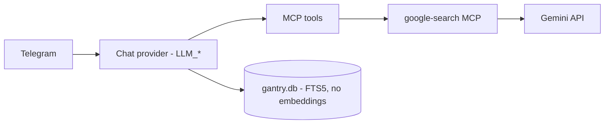

# Models (chat + search)

Tim uses **two** model surfaces. Only the first is "which brain answers Telegram."

| Surface | What it does | Default today | Swappable? |
| --- | --- | --- | --- |
| **Chat** (`LLM_*` env) | Replies, tool planning, memory consolidation, session summaries | Gemini `gemini-3.5-flash` | Yes — any OpenAI-compatible endpoint |
| **Web search MCP** | Gemini Grounding + Google Search | Same `GEMINI_API_KEY` / `GEMINI_MODEL` | Needs a Gemini key (see [web-search.md](web-search.md)) |

There are **no embeddings** anymore: gantry's memory is structured SQLite +
FTS5 keyword search, so the ZeroClaw-era `gemini-embedding-001` /
`OPENAI_API_KEY` wiring is gone.

---

## Quick map



Changing **chat** does not automatically change search.

---

## How the provider works

gantry has exactly **one provider implementation**: an OpenAI-compatible chat
client. Identity is three env vars — there is no provider registry, no
config file, no alias table:

```env
LLM_BASE_URL=...   # any OpenAI-compatible endpoint
LLM_API_KEY=...
LLM_MODEL=...
```

Compose defaults these from the familiar Gemini keys, so a plain Gemini setup
only needs `GEMINI_API_KEY`.

---

## Gemini (default)

### Env

```env
GEMINI_API_KEY=...          # chat + search MCP
GEMINI_MODEL=gemini-3.5-flash
```

Compose maps those onto gantry:

```yaml
LLM_BASE_URL: https://generativelanguage.googleapis.com/v1beta/openai
LLM_API_KEY: ${GEMINI_API_KEY}
LLM_MODEL: ${GEMINI_MODEL}
```

### Common Gemini chat IDs

| Model id | Role |
| --- | --- |
| `gemini-3.5-flash` | **Default** — cheap / fast for tool-heavy Telegram |
| `gemini-3.5-pro` | More depth when Flash is too thin |

Confirm current ids in [Google AI Studio](https://aistudio.google.com/) / Gemini API docs — Google renames often.

### Switch Gemini model only

1. Set `GEMINI_MODEL=...` in `.env`
2. Apply:

```bash
make remote-sync && make remote-restart
# local: make restart
```

The search MCP also reads `GEMINI_MODEL` from the container env (same value).

---

## xAI / Grok (chat swap)

Chat can move to Grok while Gemini stays for search — override the three
`LLM_*` vars and you're done. No config file, no compose edits.

Get a key: [console.x.ai](https://console.x.ai/) → API keys.

**`.env`:**

```env
LLM_BASE_URL=https://api.x.ai/v1
LLM_API_KEY=xai-...
LLM_MODEL=grok-4.3

# Keep Gemini for the search MCP (still required in this stack)
GEMINI_API_KEY=...
GEMINI_MODEL=gemini-3.5-flash
```

**Deploy:**

```bash
make remote-sync && make remote-restart
# or local: make restart
```

**Verify:** ask Tim something trivial, then `/status` in Telegram (shows the
active model) or check the JSON logs (`make remote-logs`).

### Suggested chat models

Check live ids/pricing: [xAI models](https://docs.x.ai/developers/models). Names change; prefer what the console lists today.

| Model id (examples) | Notes |
| --- | --- |
| `grok-4.3` | Solid general-purpose default for Tim-sized agent loops |
| `grok-4.5` | Higher capability / cost when you want more depth |

Retired slugs often **redirect** and bill at the new model's rate — pin a current id, don't assume an old "cheap" name stays cheap.

The same three-var swap works for **Ollama** or any local OpenAI-compatible
server (`LLM_BASE_URL=http://host:11434/v1`).

### Switch back to Gemini chat

1. Comment out / remove the `LLM_*` overrides in `.env`
2. Redeploy (`make remote-sync && make remote-restart`)

---

## What does *not* move with chat

| Piece | Stays on |
| --- | --- |
| [Google Search MCP](web-search.md) | Gemini (`GEMINI_API_KEY`) |
| Google Workspace / Strava / Garmin / Cast / YT Music MCPs | No LLM of their own — they are tools the **chat** model calls |

Full "no Gemini key at all" means replacing search, not only chat.

---

## Cost notes

- Tim keeps a **large** bounded context (up to ~128k estimated tokens plus fat
  MCP schemas). Cheap-per-token still adds up on tool-heavy turns.
- Flash vs Pro (Gemini) and 4.3 vs 4.5 (Grok) is usually a bigger bill lever
  than shaving a few cents on the sticker price.
- Memory consolidation and session summaries reuse the **chat** model — another
  reason the cheap Flash default is right.
- Compare current rates yourself:
  - [Gemini API pricing](https://ai.google.dev/pricing)
  - [xAI models / pricing](https://docs.x.ai/developers/models)

---

## Safety / identity (any model)

Cheaper models do **not** remove hallucination risk. gantry's memory writes are
deliberate (`memory_store` — no auto-save), which removes the worst ZeroClaw
failure mode (auto-saved wrong emails), but the model can still *store* a wrong
fact on purpose. After any provider swap:

1. Keep real identity pinned in `persona/USER.md` / `USER_GOOGLE_EMAIL` — persona outranks memory.
2. Use Telegram `/new` if a session went weird.
3. Audit memory when in doubt: `make shell` → `sqlite3 gantry.db 'SELECT * FROM memory;'`.

---

## Checklist

**Gemini model bump only**

- [ ] `GEMINI_MODEL` in `.env`
- [ ] restart / redeploy

**Chat → Grok**

- [ ] `LLM_BASE_URL` + `LLM_API_KEY` + `LLM_MODEL` in `.env`
- [ ] Keep `GEMINI_API_KEY` for search
- [ ] restart / redeploy, then `/status` to verify
