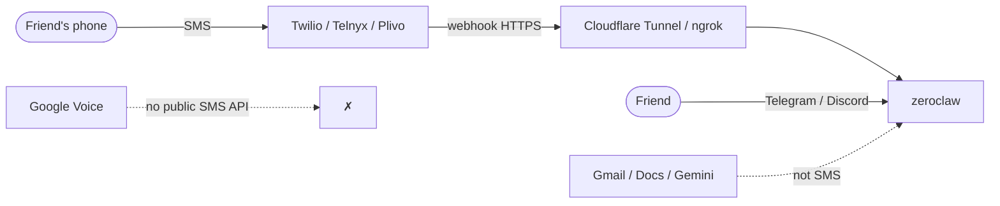

# SMS / texting for Tim (proposal — legacy research)

**Status:** research — **not wired**, and channels beyond Telegram are an
explicit ai-gantry non-goal. Kept for reference. Telegram stays the channel.

You asked about Twilio (~$1/mo number + ~$0.007/SMS) and whether **Google**
is a better fit because Tim already uses Gemini + Google Workspace. Short
answer: **Google does not sell a Twilio-shaped SMS API that plugs into GWS.**
The products that sound related are either non-programmable (Voice) or
enterprise contact-center / RCS stacks.

Upstream channel matrix:
[ZeroClaw channels overview](https://github.com/zeroclaw-labs/zeroclaw/blob/master/docs/book/src/channels/overview.md).
Friend reachability context: [docs/whatsapp.md](whatsapp.md).

---

## Does Google sell SMS numbers for bots?

| Google product | What it is | Programmatic two-way SMS for Tim? |
|---|---|---|
| **Gemini / Vertex** | LLM APIs | ❌ Text generation only — not carrier SMS |
| **Google Workspace + gws** | Gmail, Docs, Calendar, … | ❌ Email/calendar — not SMS |
| **Google Voice** (personal or Workspace) | Virtual number; call/text in the Voice *app* | ❌ **No public SMS API** — cannot drive it from ZeroClaw |
| **RCS for Business (RBM)** | Branded rich messages on Android | ❌ Enterprise / carrier partners, agent verification — not “buy a $1 number” |
| **Contact Center AI Platform (CCAI) SMS** | Contact-center queues | ❌ Enterprise product; number activation via Google support + **US 10DLC**; weeks of compliance |

So “we’re already on Google → use Google SMS” does **not** hold. GWS and Gemini
are orthogonal to carrier messaging. There is no `gws sms send` equivalent.

Unofficial Google Voice scrapers exist historically — same class of fragility as
unofficial Garmin, and worse ToS risk. **Do not plan on that.**

---

## Real SMS options (CPaaS)

All of these rent a number and expose REST + **inbound webhooks**. Pricing is
ballpark US long-code (check vendor pages; carrier surcharges and **10DLC**
fees stack on top).

| Provider | Number (approx) | US SMS (approx) | Notes |
|---|---|---|---|
| **[Twilio](https://www.twilio.com/sms)** | ~$1.15/mo | ~$0.0083/seg | Best docs / ecosystem; ZeroClaw has a [Twilio SMS feature request](https://github.com/zeroclaw-labs/zeroclaw/issues/6427) (not shipped as a first-class channel yet) |
| **[Telnyx](https://telnyx.com)** | ~$1/mo | ~$0.004/seg | Often cheaper; ZeroClaw already knows Telnyx for **voice** (`channel-voice-call` / ClawdTalk) |
| **[Plivo](https://www.plivo.com)** | ~$0.50–0.80/mo | ~$0.005+/seg | Similar CPaaS; less ecosystem |

Your mental math (~$1 + ~$0.007/text) is in the right ballpark for Twilio.
Telnyx/Plivo usually undercut per-message. For a personal bot (tens of texts
a month), **dollar difference is noise**; webhook + compliance is the real cost.

### US compliance (easy to underestimate)

Application-to-person SMS on a normal 10-digit number needs **A2P 10DLC**
(brand + campaign registration). Expect:

- One-time brand fee + monthly campaign fee (vendor pass-through; often a few
  dollars/month for low volume)
- Opt-in / use-case wording carriers care about
- Delays measured in days–weeks if registration is messy

Toll-free SMS is an alternative path (different verification). Short codes are
enterprise money.

---

## Fit with *this* stack (big caveat)

Tim’s design goal: **no published ports** (Telegram long-polls out).

SMS CPaaS inbound is the opposite: the provider **POSTs to your public HTTPS
URL**. That means Cloudflare Tunnel / Tailscale Funnel / ngrok — same pain as
WhatsApp Cloud API in [docs/whatsapp.md](whatsapp.md).

| Concern | Impact |
|---|---|
| Public webhook | Fights lean deploy; need a tunnel |
| ZeroClaw SMS channel | Twilio SMS still a **feature request** (#6427); not in the lean default binary |
| Upstream image | May need a build with extra channel features / custom Dockerfile work |
| Allowlist | Must restrict to your phone(s) — otherwise random SMS → Tim → Gemini bill |

Outbound-only SMS (Tim texts you alerts, you don’t reply) is simpler but still
needs a provider + 10DLC for US, and is a weak “chat with Tim” experience.

---

## Other options (usually better than SMS for Tim)

| Option | Tim’s identity | Friend friction | Fits “no ports”? | Verdict |
|---|---|---|---|---|
| **Stay on Telegram** | Bot | High if friends won’t install | ✅ | Already done |
| **Discord / Slack** | Bot user | Low if friends already there | ✅ | Best “reach friends” path — see whatsapp.md |
| **Email via gws** | Your Workspace address | Everyone has email; slow for chat | ✅ | Already available |
| **WhatsApp Web + real SIM** | Tim’s number | Friends already on WA | ✅ (Web mode) | Needs real mobile number, not VoIP |
| **Linq** (ZeroClaw channel) | Brokered iMessage / RCS / SMS | Friends text a number | ❌ webhook | Paid third party; richer than raw SMS if you want Apple/RCS |
| **Twilio / Telnyx SMS** | Rented number | Universal on any phone | ❌ webhook | Viable; not Google; compliance + tunnel |
| **Google Voice** | GV number | Manual texting only | n/a | ❌ cannot automate Tim |

---

## Recommendation

1. **Do not wait on a Google SMS product** for Tim — it isn’t there in a
   personal-bot shape.
2. If the goal is **chat with friends who won’t use Telegram**: prefer
   **Discord** (or Slack), then WhatsApp Web on a real SIM — not SMS.
3. If the goal is **truly SMS** (parents’ flip-phone energy, no apps):
   - Prefer **Telnyx** on price / existing ZeroClaw voice familiarity, or
     **Twilio** if you want the path of least resistance and to track
     [issue #6427](https://github.com/zeroclaw-labs/zeroclaw/issues/6427).
   - Budget for tunnel + 10DLC, not just $1 + $0.007.
4. Revisit only when ZeroClaw ships a maintained SMS channel *or* you accept
   maintaining a thin webhook shim yourself.

---

## Decision checklist

- [ ] Confirm goal: friend chat vs “Tim texts me alerts” vs both
- [ ] If friend chat → Discord/WhatsApp first; SMS last
- [ ] If SMS: pick Twilio vs Telnyx; accept tunnel + 10DLC
- [ ] Check whether upstream ZeroClaw image includes / will include Twilio SMS
- [ ] If yes later: mirror Strava-style docs (env vars, allowlist, deploy)
- [ ] Do **not** plan Google Voice automation

Until then, Tim stays on Telegram (+ optional WhatsApp/Discord paths already
documented).
