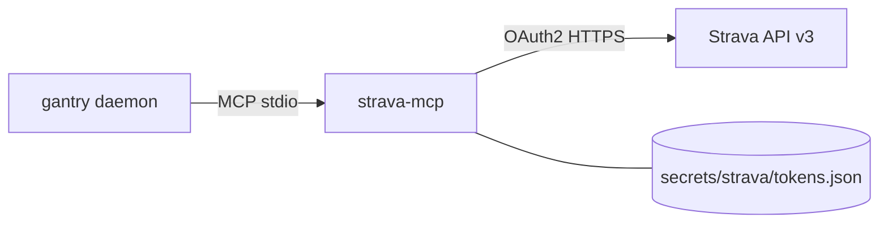

# Strava workout data (Garmin friendly)

Give Tim your training history so he can nudge you ("bro, get to the gym"),
suggest rest, and summarize the week. This uses the
[StravaMCP](https://github.com/Stealinglight/StravaMCP) server — a single static
Go binary baked into the image that gantry launches over stdio.

**Using a Garmin?** Connect the watch to Strava once (Garmin Connect → Settings →
Connected Apps → Strava). Every activity then auto-syncs to Strava and Tim reads
it here — no fragile unofficial Garmin login required.

Upstream: [StravaMCP](https://github.com/Stealinglight/StravaMCP) ·
[Strava API](https://developers.strava.com).



---

## What Tim can do

`strava-mcp` exposes 11 tools (prefixed `strava__…`). The useful ones here:

| Ask | Tool |
|---|---|
| "Summarize my workouts this week" | `strava_get_activities` + `strava_get_athlete_stats` |
| "Should I train or rest today?" | recent `strava_get_activities` (frequency / load heuristic) |
| "How was my last ride?" | `strava_get_activity_by_id`, `strava_get_activity_zones` |

> **Rest-day reality check:** true recovery metrics (HRV, Body Battery, sleep)
> are **Garmin-only**. Wire [docs/garmin.md](garmin.md) for those; with Strava
> alone, "rest today" is inferred from training frequency and load.

---

## 1. Create a Strava API app (once)

1. Go to <https://www.strava.com/settings/api>.
2. Fill in the app (any name/website). Set **Authorization Callback Domain** to
   `localhost`.
3. Copy the **Client ID** and **Client Secret** into `.env`:

```env
STRAVA_CLIENT_ID=12345
STRAVA_CLIENT_SECRET=xxxxxxxxxxxxxxxxxxxxxxxxxxxxxxxxxxxxxxxx
```

---

## 2. Authorize once (no local install)

You **don't** need Go, Homebrew, or WSL just for the one-time OAuth handshake —
the `strava-mcp` binary is already baked into the image (see `Dockerfile`). Run
its `auth` command in a throwaway container that reuses the compose env and
mounts `secrets/strava`, so the token lands on your host and survives.

The flow needs a browser and a `localhost` callback. A container has no browser,
so `strava-mcp` prints the authorization URL instead — you open it on your host,
approve, and the callback is forwarded back into the container.

```bash
make strava-auth
```

That wraps the throwaway container (builds the image if needed, publishes the
callback port, runs `strava-mcp auth`). The raw equivalent, if you're not using
`make`:

```bash
docker compose run --rm --build -p 19876:19876 --entrypoint strava-mcp gantry auth
```

1. It prints `Open this URL in your browser: https://www.strava.com/oauth/authorize?...`
2. Open that URL in your browser, approve access.
3. Strava redirects to `http://localhost:19876/callback`; the `-p 19876:19876`
   mapping forwards it into the container, which captures the code and prints
   `Authenticated as <Your Name>!`.

That writes `secrets/strava/tokens.json` (gitignored, mounted at
`/data/.config/strava`). `strava-mcp` refreshes the access token
automatically from here on.

> `--entrypoint strava-mcp` swaps the image's default `gantry` entrypoint for
> the tool binary. `STRAVA_CLIENT_ID`, `STRAVA_CLIENT_SECRET`, and
> `STRAVA_TOKEN_PATH` already come from `.env` / `docker-compose.yml`. The
> callback has a 2-minute timeout, so have the browser ready.

<details>
<summary>Alternative: run the binary directly (macOS / Linux / WSL)</summary>

Get the binary (`brew install Stealinglight/tap/strava-mcp`,
`go install github.com/Stealinglight/StravaMCP@latest`, or a
[release](https://github.com/Stealinglight/StravaMCP/releases/latest)), then from
the repo root:

```bash
export STRAVA_CLIENT_ID=12345
export STRAVA_CLIENT_SECRET=xxxxxxxx
export STRAVA_TOKEN_PATH="$PWD/secrets/strava/tokens.json"

strava-mcp auth        # opens the browser; approve access
# -> "Authenticated as <Your Name>!"
```

On **Windows** use WSL: `localhost` is shared with Windows, so the browser
callback still lands. Point `STRAVA_TOKEN_PATH` at the repo's
`secrets/strava/tokens.json`.

</details>

---

## 3. Build + deploy

```bash
make build           # bakes strava-mcp into the image
make up              # local
# or: make remote-deploy   # image/manifest only — tokens are separate
make strava-sync           # push tokens.json when you mean to
```

`make remote-deploy` does **not** copy Strava tokens (avoids clobbering the
server). `make strava-auth` auto-runs **`make strava-sync`** when
`DEPLOY_HOST` is set.

---

## 4. Ask Tim

Over Telegram:

- "Give me a summary of my workouts for the past week."
- "How many miles did I run this month?"
- "I trained hard the last three days — should I rest today?"

---

## Config (already wired)

`mcp.toml` lists the server — and with gantry, **listed = granted**. There are
no bundles, no deferred loading, and no approval prompts to configure:

```toml
[[server]]
name    = "strava"
command = "strava-mcp"
```

Tools reach the model as `strava__<tool>` (server-prefixed, eager-loaded at
boot). If the binary can't start, gantry fails the boot loudly instead of
letting the model improvise.

Credentials come from the container environment (set in `.env`, passed through
`docker-compose.yml`): `STRAVA_CLIENT_ID`, `STRAVA_CLIENT_SECRET`, and
`STRAVA_TOKEN_PATH=/data/.config/strava/tokens.json` (the mounted
`./secrets/strava`).

---

## Troubleshooting

| Symptom | Likely fix |
|---|---|
| Tim doesn't see Strava tools | Check the `[[server]]` entry exists in `mcp.toml` and rebuild so `strava-mcp` is in the image — listed = granted, nothing else to wire |
| Boot fails with `mcp: boot server "strava"` | The binary is missing or crashing at start — rebuild the image (`make build` / `make remote-deploy`) and check `make logs` for the tool's stderr |
| Auth / 401 / token errors | `make strava-auth` (or `make strava-sync` after a local re-auth) |
| No activities | Confirm the watch/app actually syncs to Strava (Garmin → Connected Apps → Strava) |
| Rate limited | Strava caps ~100 req/15 min, 1000/day — ask for summaries, not per-second polling |
| No Windows binary | Use the container flow in [step 2](#2-authorize-once-no-local-install) — no local install; only the token file needs to reach the server |
