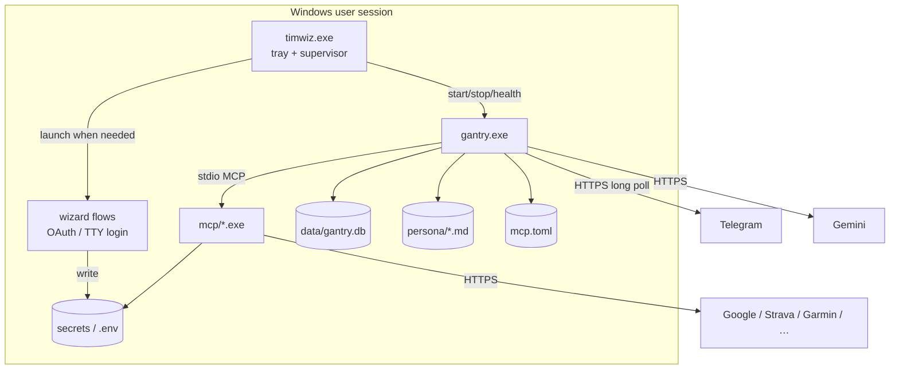

# Tim the Wizard — host companion design

<p align="center">
  
</p>

**Status:** design draft (seed for a new repo)
**Working name:** Tim the Wizard
**Repo slug:** `tim-the-wizard`
**Exe:** `timwiz.exe`
**One-liner:** The Office Wizard who wasn’t Clippy — install, prompt, wire secrets, babysit [ai-gantry](https://github.com/shotah/ai-gantry) — with **no Docker**.

Gantry was scoped for a sealed container (distroless, no shell, env + mounts only).
It is a great brain and a bad product. **Tim the Wizard** is the host-side companion who puts
training wheels on him so Tim can live as a local Windows companion.

> It looks like you’re trying to run an agent.
> Shall I prompt for Garmin?

```text
┌─────────────────────────────────────────────────────────────┐
│  timwiz.exe            ← THIS REPO (Tim the Wizard)       │
│  · first-run wizard                                         │
│  · tray / service lifecycle                                 │
│  · auth re-prompts                                          │
│  · path + env composition                                   │
│  · host policy (absolute MCP paths, no shell on PATH)       │
│                                                             │
│     └── spawns / supervises                                 │
│           gantry.exe        ← UPSTREAM (unchanged brain)    │
│                 └── mcp\*.exe  (stdio children)             │
└─────────────────────────────────────────────────────────────┘
```

Telegram still long-polls outbound. Gemini still thinks. MCP tools still act.
Nothing inbound. The only thing that changes is **who owns the host**.

---

## 1. Why a new repo

| Repo | Job |
|---|---|
| [shotah/ai-gantry](https://github.com/shotah/ai-gantry) | Runtime kernel — stay dumb, sealed, portable |
| `docker_open_claw` / tim-on-compose (existing) | Docker/Make deploy path — keep for servers |
| **`tim-the-wizard` (new)** | Native host companion — Windows-first, no Docker |

Do **not** bolt a setup UI into gantry. Do **not** wrap Docker Desktop in an
installer. Keep the brain upstream; let the wizard own the prompting.

Sibling relationship to the compose repo: same secret shapes, same `mcp.toml`
semantics, same persona files — different supervisor. Same Tim in Telegram;
Tim the Wizard is just who gets him dressed in the morning.

---

## 2. Goals / non-goals

### Goals

1. **One installer** → Tim runs on a Windows box with no Docker, no Make, no WSL required.
2. **Prompting lives in the wizard** — Gemini key, Telegram, Google OAuth, Garmin login, Strava, YouTube Music headers.
3. **Gantry stays dumb** — the wizard writes env + files; gantry only reads and runs.
4. **Same contracts** as the container world: `mcp.toml` listed = granted; secrets on disk; persona markdown; SQLite under a data dir.
5. **Zero inbound ports** preserved.
6. **Re-auth without archaeology** — tray menu → “Reconnect Google / Garmin / …”

### Non-goals (v1)

- macOS / Linux native packs (design should not forbid them; ship Windows first).
- Cast/mDNS reliability on Windows (optional later; LAN discovery is the hard part).
- Multi-agent, dashboard, web UI, plugin marketplace.
- Changing gantry’s security model upstream unless a thin `--config-root` (or similar) is truly required.
- Migrating Docker users automatically (manual copy of `persona/` + secrets is fine).
- Being Clippy. We are specifically the other guy.

---

## 3. Design principles

1. **Wizard beside the daemon, not inside it.** Timwiz owns UX + lifecycle; gantry owns the agent loop.
2. **Composition is still the ACL.** Only ship / register the MCP binaries you mean to grant. Absolute paths in the generated `mcp.toml` — never bare names that resolve via a user PATH that includes `powershell` / `cmd`.
3. **Secrets never in persona.** Persona is prompt; creds live under a secrets tree with restrictive ACLs.
4. **Idempotent setup.** Re-running the wizard updates what’s missing/expired; doesn’t stomp working tokens without asking.
5. **Boring layout.** One root directory, predictable env file, one manifest, one DB.
6. **Fail loud in the tray.** Auth expiry and child crashes surface as notifications + a clear “Fix” action, not silent log spam. (Paperclip optional. Wand preferred.)

---

## 4. Process model



### Roles

| Process | Responsibility |
|---|---|
| `timwiz.exe` | Install layout, wizard, generate env + `mcp.toml`, spawn gantry, restart policy, tray UI, re-auth entrypoints, log tail shortcut |
| `gantry.exe` | Channel + model + tool loop (upstream binary, pinned version) |
| `mcp\*.exe` | Capability servers (pinned versions); no shell wrappers |

### Supervision

- Default: **tray app** starts at login, spawns gantry as a child, restarts on crash (backoff).
- Optional later: Windows Service for headless boxes (harder for OAuth browser redirects — keep tray as v1).
- Health: poll `gantry status` (exit code) on an interval, same idea as the compose healthcheck.
- Stop: tray → Quit stops gantry tree (job object so MCP grandchildren die too).

---

## 5. On-disk layout

Default root (overridable at install):

```text
%LOCALAPPDATA%\TimTheWizard\
├── bin\
│   ├── timwiz.exe            # companion (this repo)
│   ├── gantry.exe             # pinned upstream release (windows_amd64)
│   └── mcp\
│       ├── google-workspace-mcp-go.exe
│       ├── strava-mcp.exe
│       ├── garmin.exe
│       ├── mcp-gemini-google-search.exe
│       ├── mcp-beam.exe              # optional / degraded on Windows
│       └── youtube-go-mcp.exe
├── config\
│   ├── .env                   # generated; never committed
│   └── mcp.toml               # generated; absolute command paths
├── persona\                   # SOUL.md USER.md … (seeded from examples)
├── data\                      # HOME + DATA_DIR for gantry
│   ├── gantry.db
│   └── .config\               # MCP state via HOME
│       ├── google-mcp\
│       ├── strava\
│       ├── garmin\
│       └── ytmusic\
├── logs\
│   ├── wizard.log
│   └── gantry.log
└── state\
    ├── install.json           # versions pinned, install time
    └── setup.json             # wizard checklist / last auth errors
```

### Env contract (Timwiz → gantry)

Timwiz sets these when spawning gantry (names match the compose world):

| Variable | Value |
|---|---|
| `HOME` | `%LOCALAPPDATA%\TimTheWizard\data` |
| `DATA_DIR` | same as `HOME` |
| `PERSONA_DIR` | `...\persona` |
| `MCP_MANIFEST` | `...\config\mcp.toml` |
| `CHANNEL` | `telegram` |
| `LLM_*` / `GEMINI_*` | from wizard / `.env` |
| `TELEGRAM_*` | from wizard / `.env` |
| `WORKSPACE_MCP_CREDENTIALS_DIR` | `...\data\.config\google-mcp\credentials` |
| `STRAVA_TOKEN_PATH` | `...\data\.config\strava\tokens.json` |
| `YTMUSIC_HEADERS_PATH` | `...\data\.config\ytmusic\headers.json` |
| `TZ` / `CRON_TZ` | from wizard (default local zone) |

Garmin keeps using `HOME` → `%HOME%\.config\garmin\session.json` (go-garmin
`UserConfigDir` behavior). No password in env.

### Generated `mcp.toml`

Timwiz writes absolute Windows paths:

```toml
[[server]]
name = "google-workspace"
command = 'C:\Users\…\AppData\Local\TimTheWizard\bin\mcp\google-workspace-mcp-go.exe'
args = ["--tools", "gmail drive calendar docs sheets tasks contacts", "--tool-tier", "complete", "--capability", "complete"]

[[server]]
name = "garmin"
command = 'C:\Users\…\AppData\Local\TimTheWizard\bin\mcp\garmin.exe'
args = ["mcp", "--tool-tier", "core"]

# …only servers the user enabled in the wizard
```

Listed = granted remains the model. Disabling a tool in the UI regenerates the
manifest and restarts gantry.

---

## 6. Wizard & auth flows

First launch (or tray → Setup) walks a checklist. Each step is skippable except
core (Gemini + Telegram + allowlist).

### 6.1 Core (required)

1. Gemini API key (+ optional model).
2. Telegram bot token (deep-link to BotFather docs).
3. Allowed user id(s).
4. Timezone. (Wizard picks the zone; Tim lives in it.)

Writes `config\.env`. Does not start gantry until core is valid (token shape checks + optional `gantry status` smoke after start).

### 6.2 Google Workspace

Parity with compose `google-auth`:

1. Collect OAuth client id/secret + account email (or deep-link to Cloud Console doc).
2. Run a small local HTTP listener on `localhost:4100` (or next free port).
3. Open browser consent URL.
4. Exchange code → write `data\.config\google-mcp\credentials\<email>.json`.
5. Mark step complete in `state\setup.json`.

Implementation options (prefer in this order):

1. **Port the existing Python/PS auth scripts into Go inside `timwiz`** (one binary).
2. Shell out to a tiny helper exe shipped beside Timwiz (still no Docker).

No host `gws` CLI dependency.

### 6.3 Garmin

Parity with `garmin login` (interactive, MFA-capable):

1. Tray opens a console helper or embedded prompt UI.
2. Invoke `garmin.exe login` with a real TTY (Windows ConPTY).
3. On success, `session.json` lands under `data\.config\garmin\`.
4. On failure, keep the error in `setup.json` and offer Retry.

Do not put Garmin email/password into `.env`.

### 6.4 Strava

Localhost OAuth callback (same pattern as Google). Write `tokens.json`. Persist
client id/secret in `.env`.

### 6.5 YouTube Music

Guided paste of browser request headers → `headers.json` (same as current
`ytmusic-auth` flow). This will stay a bit manual; the wizard just makes the paste
UX obvious.

### 6.6 Optional / degraded

| Integration | v1 stance |
|---|---|
| Google Search MCP | Enable if Gemini key present (same key). |
| Cast / mcp-beam | Ship binary but default **off**; docs say “best on Linux LAN host.” |
| Discord/Slack | Out of scope until gantry channel support is something we productize. |

### Re-auth

Tray menu per integration:

- Reconnect Google / Strava / Garmin / YouTube Music
- Open data folder / Open logs
- Edit allowlist
- Restart Tim / Quit

Token/session death should also nudge: Timwiz watches gantry logs (or a small
status file if we add one later) for known auth-failure strings and balloons
“Garmin session expired — click to re-login.”

---

## 7. Host security (Docker substitute)

Container composition was the sandbox. On Windows we approximate:

1. **Absolute MCP commands only** in `mcp.toml`.
2. **Spawn env scrub** — gantry child gets a minimal env (contract vars + `SystemRoot` / `ComSpec` only if required by Go runtime). Do not inherit the user’s full junk PATH into MCP kids if we can avoid it; set `PATH` to `bin\mcp` + `bin` only.
3. **No shell in the tree.** Never ship `cmd` wrappers; never set MCP command to `powershell.exe …`.
4. **ACL the secrets tree** — after write, restrict `data\.config` and `config\.env` to the current user (icacls / Go ACL helpers).
5. **Job object** — gantry + MCP children in one Windows Job so Quit / crash cleanup doesn’t leave orphans.
6. **Allowlist remains auth** — `TELEGRAM_ALLOWED_USERS` is still the gate for who can talk to Tim.
7. **No elevation required** — per-user install under LocalAppData; no Program Files, no service account for v1.

Out of scope for v1 (nice later): AppContainer / low-priv user, firewall lock to Telegram/Gemini/API domains only.

---

## 8. Packaging & updates

### Ship form

- **v1:** single zip or Inno Setup installer that drops the layout under LocalAppData and creates a Startup shortcut / Run key for the tray.
- Pin versions in `state\install.json` (`gantry` semver + each MCP version).
- Code-sign if we have a cert; otherwise document SmartScreen expectations honestly.
- Tray / installer icon: the wizard SVG (rasterized to `.ico`).

### Update strategy

1. Timwiz checks GitHub Releases for `tim-the-wizard` on a cadence.
2. Upstream `gantry` / MCP bumps are **wizard releases** — we vendor/pin binaries; users don’t scrape five repos.
3. Update flow: download → stage → stop gantry → replace bins → start → migrate `setup.json` if needed.
4. Persona and secrets never overwritten by updates.

### Build pipeline (new repo)

```text
CI (tag vX.Y.Z)
  → build timwiz (Go) for windows/amd64
  → fetch/pin gantry + MCP windows_amd64 artifacts (or cross-build static Go MCPs)
  → assemble payload dir
  → zip + optional installer
  → GitHub Release
```

Prefer MCP projects that already publish Windows binaries; otherwise cross-compile
static Go (`CGO_ENABLED=0 GOOS=windows`).

---

## 9. Suggested repo shape

```text
tim-the-wizard/
├── README.md
├── DESIGN.md                  # this document (canonical)
├── LICENSE
├── go.mod
├── cmd/
│   └── timwiz/
│       └── main.go            # tray entrypoint
├── internal/
│   ├── layout/                # paths, seed dirs, ACLs
│   ├── envgen/                # .env + mcp.toml generation
│   ├── supervisor/            # job object, start/stop, health
│   ├── wizard/                # core + per-provider flows
│   ├── auth/
│   │   ├── google/
│   │   ├── strava/
│   │   ├── garmin/            # ConPTY around garmin.exe login
│   │   └── ytmusic/
│   ├── tray/                  # systray menu + notifications
│   └── update/                # release check
├── persona/
│   └── *.example.md           # seed templates (Tim defaults or neutral)
├── pack/
│   ├── mcp.toml.tmpl
│   ├── .env.tmpl
│   ├── assets/
│   │   └── tim-the-wizard.svg
│   └── installer/             # Inno / WiX scripts
├── scripts/
│   └── fetch-bins.ps1         # pin + download upstream windows bins
└── docs/
    ├── setup.md
    ├── auth-google.md
    ├── auth-garmin.md
    └── security.md
```

Language: **Go** — matches gantry/MCP ecosystem, single static exe, easy ConPTY
and systray (`getlantern/systray` or `energye/systray`).

---

## 10. Relationship to upstream gantry

### Keep unchanged if possible

- Agent loop, Telegram channel, MCP stdio client, SQLite memory, cron/heartbeat.
- Env-var config surface (`DATA_DIR`, `PERSONA_DIR`, `MCP_MANIFEST`, …).

### Ask upstream only if forced

| Need | Prefer first | Upstream only if |
|---|---|---|
| Config root on Windows | Timwiz sets absolute env paths | gantry assumes Unix-only paths |
| Status for tray | `gantry status` already | need richer machine-readable status JSON |
| Auth error signals | log scraping | structured event / exit codes per provider |

Document every upstream ask in `docs/gantry-asks.md` so the companion doesn’t
quietly fork the brain.

---

## 11. Migration from the Docker Tim repo

Manual, documented:

1. Copy `persona\*.md` → `persona\`.
2. Copy secrets:
   - `secrets/google-mcp/` → `data\.config\google-mcp\`
   - `secrets/strava/` → `data\.config\strava\`
   - `secrets/garmin/` → `data\.config\garmin\`
   - `secrets/ytmusic/` → `data\.config\ytmusic\`
3. Copy relevant `.env` keys into the wizard or `config\.env`.
4. Leave `data/gantry.db` optional — copy for session continuity, or start clean.

Timwiz can ship an “Import from compose tree…” picker that does the path mapping.

---

## 12. Phased delivery

### Phase 0 — Skeleton

- Layout bootstrap, `.env` / `mcp.toml` generation, supervise `gantry.exe` with empty/core MCP set.
- Tray: Start / Stop / Logs / Quit.
- Proof: Telegram echo with Gemini, no extra tools.

### Phase 1 — Core wizard

- Wizard for Gemini + Telegram + allowlist.
- Job object + env scrub + ACL secrets.
- Installer / zip release + tray icon from the SVG.

### Phase 2 — Auth providers

- Google OAuth (localhost).
- Garmin ConPTY login.
- Strava OAuth.
- YT Music header paste.
- Re-auth menu + expiry nudges.

### Phase 3 — Polish

- Auto-update.
- Import-from-compose.
- Optional Cast toggle (document Windows limits).
- Code signing.

### Phase 4 — Stretch

- Windows Service mode.
- macOS companion (same layout under `~/Library/Application Support/TimTheWizard`).
- Stronger host sandbox (AppContainer / egress allowlist).

---

## 13. Acceptance criteria (v1 “usable companion”)

A fresh Windows machine, no Docker:

1. Install Tim the Wizard from a Release asset.
2. Complete core wizard in &lt; 10 minutes.
3. Message the bot on Telegram; get a Gemini reply.
4. Connect Google; ask “what’s on my calendar tomorrow?” and get a real answer.
5. Connect Garmin; ask “how did I sleep?” and get a real answer.
6. Quit from tray; no orphan `gantry` / MCP processes.
7. Reboot; tray auto-starts; Tim answers again without re-auth.

---

## 14. Naming & branding

| Item | Value |
|---|---|
| Repo | `tim-the-wizard` |
| Product name | **Tim the Wizard** |
| Mascot | Office Assistant Merlin throwback (hat, beard, clock-staff) — see `docs/assets/tim-the-wizard.svg` |
| Tray tooltip | `Tim the Wizard — local companion` |
| Exe | `timwiz.exe` |
| Data root | `%LOCALAPPDATA%\TimTheWizard` |
| Agent in chat | still **Tim** in chat; Tim the Wizard is the tray companion that dresses him |

Tagline for README:

> Not Clippy. The other guy.
> A Windows wizard that dresses a container-scoped agent so Tim can live on your machine without Docker.

---

## 15. Open questions (decide at repo birth)

1. **Persona default:** ship Tim’s climbing-coach examples, or a neutral “personal assistant” seed?
2. **Binary licensing:** confirm each MCP’s license allows redistribution in our Release zip.
3. **Garmin UI:** console window vs embedded GUI prompts for MFA.
4. **Single-exe vs installed tree:** systray + many MCP exes strongly favors an installed tree (not a pure fyne oneshot).
5. **Does gantry publish `windows_amd64` today?** If not, Phase 0 includes cross-compile / upstream release ask.
6. **Voice lines:** how many “It looks like you’re trying to…” strings is too many? (Answer: one fewer than Clippy.)

---

## 16. What this file is for

Drop this document into the new repo as `DESIGN.md` (or split README + DESIGN),
and copy `docs/assets/tim-the-wizard.svg` into `pack/assets/`.

It is the contract: **wizard beside gantry, same secret shapes, no Docker, Windows-first.**

When the repo exists, Phase 0 is: `cmd/timwiz` that creates the layout and
spawns a pinned `gantry.exe` with core env — nothing else until that feels boring
and solid.
