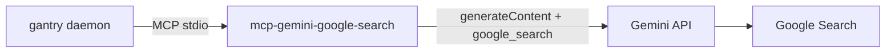

# Web search (Gemini Google Search grounding)

gantry has no built-in web search (by design — capabilities are MCP binaries).
We bake
[zchee/mcp-gemini-google-search](https://github.com/zchee/mcp-gemini-google-search)
— a static Go MCP that calls **Gemini Grounding with Google Search** using the
same `GEMINI_API_KEY` already in `.env`. (The old ZeroClaw built-in scraped
DuckDuckGo and hit bot walls from Docker; this is the fix that stuck.)



---

## Setup

Nothing extra beyond the Gemini key you already use for chat:

1. `.env` has `GEMINI_API_KEY` (paid / billing-enabled AI Studio project so
   grounding is allowed).
2. `GEMINI_MODEL` defaults to `gemini-3.5-flash` — chat **and** the search MCP
   both use it (the MCP reads `GEMINI_MODEL` / `GEMINI_API_KEY` from the
   container env).
3. Rebuild and restart:

```bash
make build && make up
# or: make remote-deploy
```

Optional pin override:

```bash
# GEMINI_SEARCH_MCP_REF=1fe676adcdaa79ed0798fd32be0695ffee15c644
```

---

## Config wiring

`mcp.toml` (listed = granted):

```toml
[[server]]
name    = "google-search"
command = "mcp-gemini-google-search"
```

Tool Tim should use: `google-search__google_search` (query string).

---

## Cost (ballpark)

Gemini 3 grounding (paid tier): ~**5,000 free grounded prompts / month**, then
about **$14 / 1,000 search queries**. Chat tokens are separate (already billed
via `GEMINI_API_KEY`). Free (no-billing) Gemini projects often cannot use
grounding.

---

## Smoke tests

```bash
make build
docker compose run --rm --entrypoint mcp-gemini-google-search gantry -h || true
# Binary is stdio-only; real check is Telegram:
```

Ask Tim: “Search the web for today’s Seattle weather summary.”

He should call `google-search__google_search`.

---

## Troubleshooting

| Symptom | Likely fix |
|---|---|
| Tim doesn’t see `google_search` | Check the `[[server]]` entry in `mcp.toml`; rebuild so the binary is present |
| `GEMINI_API_KEY` / grounding errors | Billing enabled on the Google AI project; key has access to search grounding |
| Expensive search model | Keep `GEMINI_MODEL=gemini-3.5-flash` (MCP defaults to a Pro preview if unset) |
