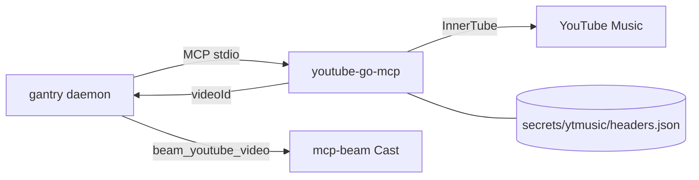

# YouTube Music (search + library)

Give Tim real YouTube Music search and library reads via
[youtube-go-mcp](https://github.com/shotah/youtube-go-mcp) — a **static Go** MCP
server. Premium rides on your browser session (cookie headers), not a YouTube
Data API key. gantry launches the binary over stdio.

Upstream: [shotah/youtube-go-mcp](https://github.com/shotah/youtube-go-mcp) ·
seeded from [raitonoberu/ytmusic](https://github.com/raitonoberu/ytmusic).



**Cast is separate.** This MCP returns `videoId` (+ watch URLs for reference).
Playback goes through [docs/cast.md](cast.md) via `beam_youtube_video` with the
bare `videoId` — do **not** invent royalty-free MP3 fallbacks, and do **not**
pass Music/YouTube watch URLs to `beam_media`.

---

## What Tim can do

Tools are prefixed `ytmusic__…` (server name `ytmusic` in `mcp.toml`):

| Ask | Tool | Auth |
|---|---|---|
| “Search YouTube Music for …” | `search_tracks` | optional |
| “What playlists do I have?” | `get_library_playlists` | required |
| “What’s on playlist X / Liked Songs?” | `get_playlist` (`LM` = liked) | depends |
| “What have I liked?” | `get_liked_songs` | required |
| “What did I listen to recently?” | `get_history` | required |
| Radio / continuum from a track | `get_watch_playlist` | optional |
| Track metadata / lyrics | `get_track`, `get_lyrics` | optional |
| Cast payload + hint for a `videoId` | `format_cast_target` | no |

`format_cast_target` (v0.0.3+) returns URLs plus a hint to call mcp-beam
`beam_youtube_video` with the bare `video_id`.

---

## 1. Optional `.env` pin

Defaults to GitHub `latest` each build. Pin only to freeze:

```env
# YOUTUBE_GO_MCP_VERSION=v0.0.3
```

Compose always sets:

```text
YTMUSIC_HEADERS_PATH=/data/.config/ytmusic/headers.json
```

---

## 2. Authorize once (browser headers)

Library tools need cookies from a signed-in [music.youtube.com](https://music.youtube.com)
session (Premium recommended).

```bash
make ytmusic-auth
```

That runs `youtube-go-mcp auth` in a throwaway container and writes
`secrets/ytmusic/headers.json` (gitignored).

Manual equivalent (host binary or after `make build`):

```bash
docker compose run --rm --build -it --entrypoint youtube-go-mcp gantry \
  auth --out /data/.config/ytmusic/headers.json
```

The CLI prompts for two values from DevTools → Network → a `browse` request →
**Request Headers**: `cookie` and `x-goog-authuser`. Full steps:
[upstream auth docs](https://github.com/shotah/youtube-go-mcp/blob/main/docs/auth.md).

Validate:

```bash
docker compose run --rm --entrypoint youtube-go-mcp gantry --self-test
```

Search can work without headers; library / liked / history will not.

Re-run `make ytmusic-auth` when tools return session expired / HTTP 401–403.

---

## 3. Deploy / restart

```bash
make build           # bakes youtube-go-mcp into the image
make up              # or make remote-deploy
make ytmusic-sync    # push headers when you mean to (not part of remote-deploy)
```

`make remote-deploy` does **not** copy YT Music headers. `make ytmusic-auth`
auto-runs **`make ytmusic-sync`** when `DEPLOY_HOST` is set.

---

## Config wiring

`mcp.toml` already has (listed = granted):

```toml
[[server]]
name    = "ytmusic"
command = "youtube-go-mcp"
```

---

## Smoke tests

```bash
make build
docker compose run --rm --entrypoint youtube-go-mcp gantry --version
docker compose run --rm --entrypoint youtube-go-mcp gantry --self-test
```

Ask Tim over Telegram:

- “Search YouTube Music for … and play it on the kitchen Nest”
- “List my YouTube Music playlists”
- “What have I liked lately?”

Flow: `search_tracks` / library → pick `videoId` → (optional
`format_cast_target`) → Cast `beam_youtube_video` with bare `video_id` + room
device.

---

## Troubleshooting

| Symptom | Likely fix |
|---|---|
| Tim doesn’t see YT Music tools | Grant bundle `"ytmusic"`; rebuild so `youtube-go-mcp` is in the image |
| `youtube-go-mcp: not found` | `make build` / `make remote-deploy` |
| Library tools fail; search works | Missing/expired headers — `make ytmusic-auth` (or `make ytmusic-sync`) |
| `--self-test` liked/library fail | Re-export headers from a fresh authenticated `/browse` call |
| Nest connects but silence | Agent used `beam_media` with a watch URL — must use `beam_youtube_video` + `videoId` |
| Cast plays royalty-free junk | Use `videoId` from this MCP; don’t invent free MP3s |

---

## Follow-ups

- [x] Cast-by-video-ID via mcp-beam `beam_youtube_video` ([docs/cast.md](cast.md))
- [x] Cast hint → `beam_youtube_video`; bake defaults to GitHub `latest`
